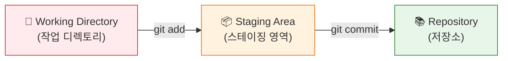
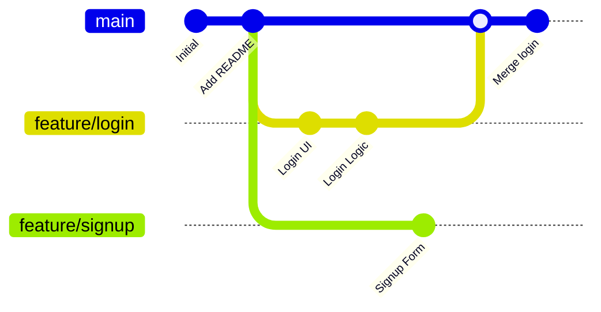
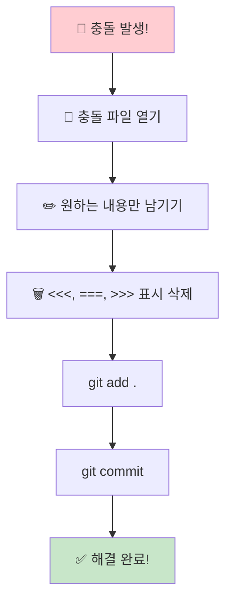
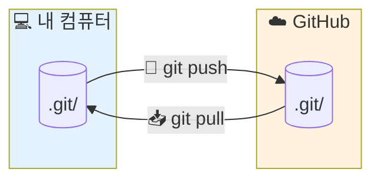
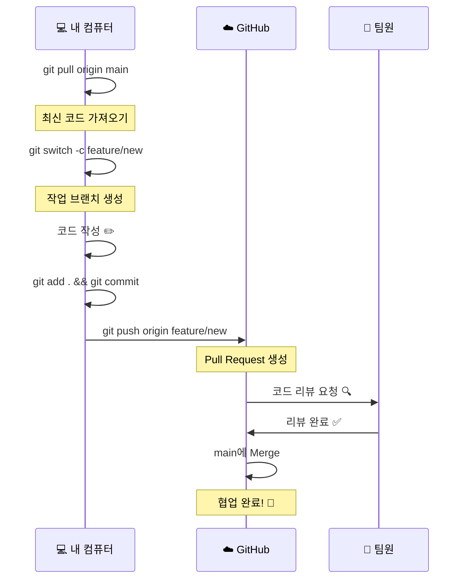
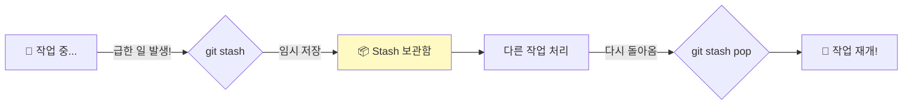
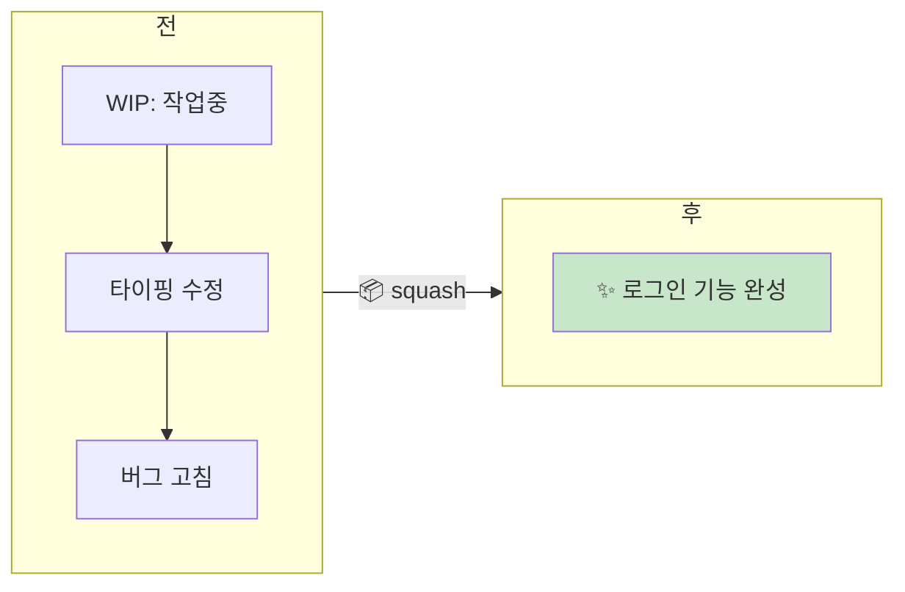
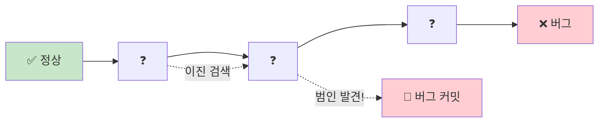
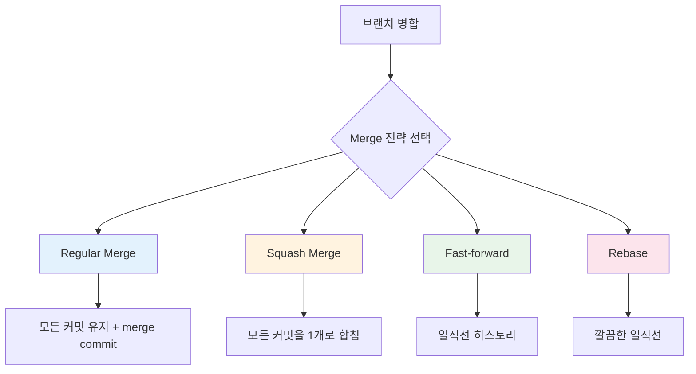
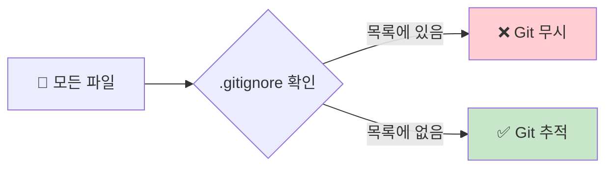

<div align="center">


<a href="https://git-scm.com">
  
</a>


**초보자도 쉽게 이해할 수 있는 Git 사용법 완전 정복!**

[시작하기](#-git-설치하기) • [기본 명령어](#-기본-명령어) • [브랜치](#-브랜치-다루기) • [협업](#-협업하기)

---

### 📊 학습 진행도

```
기초     ████████░░░░░░░░░░░░░░░░░░  30%  초급
중급     ░░░░░░░░░░░░░░░░░░░░░░░░░░   0%  브랜치 & 협업
고급     ░░░░░░░░░░░░░░░░░░░░░░░░░░   0%  Rebase & 고급 기능
```

</div>

---

## 📚 목차

### 🌱 초급
1. [Git이란 무엇인가?](#-git이란-무엇인가)
2. [Git 설치하기](#-git-설치하기)
3. [Git 초기 설정](#%EF%B8%8F-git-초기-설정)
4. [저장소 만들기](#-저장소-만들기)
5. [Git의 3가지 영역 이해하기](#-git의-3가지-영역-이해하기)
6. [기본 명령어](#%EF%B8%8F-기본-명령어)

### 🌿 중급
7. [브랜치 다루기](#-브랜치-다루기)
8. [원격 저장소 (GitHub)](#-원격-저장소-github)
9. [협업하기](#-협업하기)
10. [되돌리기](#-되돌리기)
11. [Merge 전략](#-merge-전략)

### 🚀 고급
12. [고급 기능](#-고급-기능)
13. [Interactive Rebase](#-interactive-rebase)
14. [Git Reflog - 실수 복구](#-git-reflog---실수-복구)
15. [Git Bisect - 버그 찾기](#-git-bisect---버그-찾기)
16. [Git Hooks - 자동화](#-git-hooks---자동화)
17. [Git Submodule](#-git-submodule)
18. [유용한 팁들](#-유용한-팁들)

---

## 🤔 Git이란 무엇인가?

<div align="center">


</div>

### 📖 쉬운 설명

Git은 **"파일의 변경 이력을 기록하고 관리하는 시스템"** 입니다.

```
🎮 게임으로 비유하면...

   세이브 포인트 1    세이브 포인트 2    세이브 포인트 3
        💾 ─────────────── 💾 ─────────────── 💾
        │                  │                  │
    "마을 도착"      "보스 앞 도착"      "보스 클리어"
        
    ↳ 언제든 이전 세이브 포인트로 돌아갈 수 있어요!
```

### ✨ Git을 사용하면 좋은 점

<table>
<tr>
<td align="center" width="25%">

### 🕐
**시간 여행**

언제든 과거 버전으로
돌아갈 수 있어요

</td>
<td align="center" width="25%">

### 👥
**협업**

여러 명이 동시에
작업할 수 있어요

</td>
<td align="center" width="25%">

### 🔒
**백업**

코드를 안전하게
보관할 수 있어요

</td>
<td align="center" width="25%">

### 🌿
**실험**

새로운 기능을 안전하게
테스트할 수 있어요

</td>
</tr>
</table>

### 🎬 Git 없는 세상 vs Git 있는 세상

| Git 없이 😱 | Git과 함께 😊 |
|:---|:---|
| `report_final.doc` | `git commit -m "보고서 초안"` |
| `report_final_진짜.doc` | `git commit -m "보고서 수정"` |
| `report_final_진짜_최종.doc` | `git commit -m "보고서 최종"` |
| `report_final_진짜_최종_수정.doc` | `git log` 로 모든 버전 확인! |
| 🤯 파일 20개... | 😎 파일 1개 + 히스토리 |

---

## 💻 Git 설치하기

> 💡 **Tip**: 자신의 운영체제에 맞는 탭을 확인하세요!

<details>
<summary>🪟 <b>Windows</b> (클릭해서 펼치기)</summary>
<br>

#### 설치 방법
1. 🌐 [https://git-scm.com](https://git-scm.com) 접속
2. 📥 "Download for Windows" 클릭
3. ▶️ 설치 파일 실행 (기본 옵션으로 설치 OK!)

```bash
# 설치 후 Git Bash 또는 PowerShell에서 확인
git --version
```

</details>

<details>
<summary>🍎 <b>macOS</b> (클릭해서 펼치기)</summary>
<br>

#### 방법 1: Homebrew 사용 (권장)
```bash
brew install git
```

#### 방법 2: Xcode Command Line Tools
```bash
xcode-select --install
```

</details>

<details>
<summary>🐧 <b>Linux</b> (클릭해서 펼치기)</summary>
<br>

#### Ubuntu/Debian
```bash
sudo apt-get update
sudo apt-get install git
```

#### Fedora
```bash
sudo dnf install git
```

#### Arch Linux
```bash
sudo pacman -S git
```

</details>

### ✅ 설치 확인

```bash
git --version
```

```
📤 출력 예시:
git version 2.42.0
```

---

## ⚙️ Git 초기 설정

Git을 처음 사용한다면, **반드시** 사용자 정보를 설정해야 해요!

### 👤 사용자 정보 설정

```bash
# 이름 설정 (커밋에 표시될 이름)
git config --global user.name "홍길동"

# 이메일 설정 (GitHub 계정 이메일과 동일하게!)
git config --global user.email "gildong@example.com"
```

### 🔍 설정 확인

```bash
git config --list
```

```
📤 출력 예시:
user.name=홍길동
user.email=gildong@example.com
```

### 🎨 추가 유용한 설정

```bash
# 기본 브랜치 이름을 'main'으로 설정
git config --global init.defaultBranch main

# 출력을 컬러풀하게!
git config --global color.ui auto

# 기본 에디터 설정 (VS Code)
git config --global core.editor "code --wait"
```

---

## 📁 저장소 만들기

<div align="center">


</div>

### 🆕 새 저장소 만들기 (git init)

```bash
# 1. 프로젝트 폴더 생성
mkdir my-project
cd my-project

# 2. Git 저장소로 초기화
git init
```

```
📤 결과:
Initialized empty Git repository in /my-project/.git/

📂 폴더 구조:
my-project/
    └── .git/  ← 🔮 Git의 마법이 담긴 숨겨진 폴더!
```

### 📥 기존 저장소 복제하기 (git clone)

```bash
# GitHub의 프로젝트를 내 컴퓨터로 복사
git clone https://github.com/username/repository.git
```

```
🎯 Tip: 
   git clone은 전체 히스토리를 포함해서 가져와요!
   └── 모든 커밋 기록
   └── 모든 브랜치
   └── 모든 태그
```

### 🎛️ git clone 유용한 옵션들

```bash
# 특정 브랜치만 클론
git clone -b develop https://github.com/username/repo.git

# 폴더 이름 지정해서 클론
git clone https://github.com/username/repo.git my-folder

# 최신 커밋만 가져오기 (얕은 클론 - 빠름!)
git clone --depth 1 https://github.com/username/repo.git

# 특정 태그로 클론
git clone --branch v1.0.0 https://github.com/username/repo.git
```

---

## 🎯 Git의 3가지 영역 이해하기

<div align="center">

</div>

> [!IMPORTANT]
> 💡 **이것만 이해하면 Git의 80%는 끝!**



<table>
<tr>
<td align="center" width="33%">

### 📂 Working Directory
**작업 디렉토리**

```
파일을 수정하는 곳
✏️ 코드 작성 중...
```

</td>
<td align="center" width="33%">

### 📦 Staging Area
**스테이징 영역**

```
커밋할 파일을 준비
📋 대기열에 추가!
```

</td>
<td align="center" width="33%">

### 📚 Repository
**저장소**

```
변경 이력이 저장
💾 영구 보관!
```

</td>
</tr>
<tr>
<td align="center">⬇️</td>
<td align="center">⬇️</td>
<td align="center">⬇️</td>
</tr>
<tr>
<td align="center"><code>파일 수정</code></td>
<td align="center"><code>git add</code></td>
<td align="center"><code>git commit</code></td>
</tr>
</table>

### 🍕 피자 만들기로 비유하면...

```
🏠 주방 (Working Directory)
   │
   │  피자 반죽을 만들고 토핑을 올려요
   │
   ↓ [git add] "이 피자 굽기로 했어요!"
   
🍳 오븐 앞 대기 (Staging Area)
   │
   │  구울 피자들이 줄 서서 대기 중
   │
   ↓ [git commit] "피자 완성!"
   
📸 완성된 피자 사진첩 (Repository)
   
   모든 피자의 기록이 남아있어요!
   → 언제든 다시 같은 피자를 만들 수 있어요!
```

---

## 🛠️ 기본 명령어

<div align="center">


</div>

### 📊 상태 확인 (git status)

```bash
git status
```

```
📤 출력 예시:

On branch main

Changes not staged for commit:
  (use "git add <file>..." to update what will be committed)
        
        🔴 modified:   README.md      ← 수정되었지만 아직 add 안 함

Untracked files:
  (use "git add <file>..." to include in what will be committed)
        
        🟡 new-file.txt               ← 새 파일 (Git이 아직 추적 안 함)
```

### ➕ 스테이지에 추가 (git add)

```bash
# 특정 파일 추가
git add README.md

# 여러 파일 추가
git add file1.txt file2.txt

# 현재 폴더의 모든 변경사항 추가 ⭐ 가장 많이 씀!
git add .

# 특정 확장자만 추가
git add *.js
```

```
📊 상태 변화:

BEFORE (git add 전)              AFTER (git add 후)
━━━━━━━━━━━━━━━━━━              ━━━━━━━━━━━━━━━━━
🔴 modified: README.md    →    🟢 modified: README.md
   (빨간색 = Unstaged)            (녹색 = Staged)
```

### 💾 커밋하기 (git commit)

```bash
# 기본 커밋
git commit -m "커밋 메시지를 여기에 작성"

# add + commit 한 번에! (새 파일은 안 됨, 수정된 파일만)
git commit -am "메시지"
```

### 📝 좋은 커밋 메시지 작성법

> [!NOTE]
> 커밋 메시지는 **미래의 나**와 **팀원**을 위한 것입니다!

<table>
<tr>
<td width="50%">

#### ✅ 좋은 예시

| 이모지 | 타입 | 설명 |
|:---:|:---|:---|
| ✨ | `feat` | 새 기능 추가 |
| 🐛 | `fix` | 버그 수정 |
| 📝 | `docs` | 문서 수정 |
| 🎨 | `style` | 코드 포맷팅 |
| ♻️ | `refactor` | 코드 리팩토링 |
| 🧪 | `test` | 테스트 추가 |
| 🚀 | `deploy` | 배포 |
| 🔧 | `config` | 설정 변경 |

</td>
<td width="50%">

#### ❌ 나쁜 예시

```diff
- 수정함
- fix
- ㅇㅇ  
- asdf
- update
- 1
```

> 🤔 나중에 이게 뭔지 아무도 모릅니다...

</td>
</tr>
</table>

#### 💡 커밋 메시지 템플릿

```
<타입>(<범위>): <제목>

<본문> (선택사항)

<꼬리말> (선택사항)
```

**예시:**
```
✨ feat(auth): 소셜 로그인 기능 추가

- Google OAuth 2.0 연동
- 로그인 성공 시 토큰 저장
- 자동 로그인 기능 구현

Closes #123
```

### 📜 커밋 기록 보기 (git log)

```bash
# 기본 로그
git log

# 한 줄로 보기 ⭐
git log --oneline

# 그래프로 보기 (브랜치 시각화)
git log --oneline --graph --all

# 최근 5개만 보기
git log -5

# 특정 파일의 로그만 보기
git log -- README.md

# 특정 작성자의 커밋만
git log --author="홍길동"

# 날짜 범위로 필터링
git log --since="2024-01-01" --until="2024-12-31"

# 커밋 내용(diff) 함께 보기
git log -p

# 변경된 파일 목록만 보기
git log --stat
```

```
📤 git log --oneline 출력 예시:

a1b2c3d (HEAD -> main) ✨ 로그인 기능 추가
e4f5g6h 📝 README 수정
i7j8k9l 🎉 프로젝트 시작

   ↑       ↑
커밋 해시   커밋 메시지
(고유 ID)
```

### 📋 변경 내용 보기 (git diff)

```bash
# 작업 디렉토리의 변경사항 보기
git diff

# 스테이지된 변경사항 보기
git diff --staged

# 두 커밋 비교하기
git diff 커밋해시1 커밋해시2
```

```
📤 출력 예시:

diff --git a/README.md b/README.md
--- a/README.md
+++ b/README.md
@@ -1,3 +1,4 @@
 # My Project
 
-Hello World          ← 🔴 삭제된 줄
+Hello Git!           ← 🟢 추가된 줄
+Welcome!             ← 🟢 추가된 줄
```

---

## 🌿 브랜치 다루기

<div align="center">


</div>

### 🤔 브랜치란?

> [!TIP]
> 브랜치 = **독립적인 작업 공간** (나무의 가지처럼!)



```
🌳 브랜치 시각화:

                    🌿 feature/login (로그인 개발 중)
                   /
    ──●────●────●────●  main (메인 브랜치)
                   \
                    🌿 feature/signup (회원가입 개발 중)

✨ 각 브랜치에서 독립적으로 개발 후, 나중에 합치면 됩니다!
```

### 📋 브랜치 목록 보기

```bash
# 로컬 브랜치 목록
git branch

# 원격 브랜치 포함 모든 브랜치
git branch -a
```

```
📤 출력 예시:

* main                    ← * 표시 = 현재 브랜치
  feature/login
  feature/signup
```

### 🆕 브랜치 생성

```bash
# 브랜치 생성만
git branch feature/login

# 브랜치 생성 + 이동 ⭐
git checkout -b feature/login

# 최신 버전 (위와 동일)
git switch -c feature/login
```

### 🔄 브랜치 이동

```bash
# 기존 방식
git checkout main

# 최신 방식 ⭐
git switch main
```

### 🔀 브랜치 병합 (merge)

```bash
# 1. 먼저 병합 받을 브랜치로 이동
git switch main

# 2. 다른 브랜치를 현재 브랜치로 병합
git merge feature/login
```

```
병합 전:
                    ●────● feature/login
                   /
    ──●────●────●  main


병합 후 (git merge feature/login):

                    ●────●
                   /      \
    ──●────●────●──────────● main (+ feature/login 내용)
```

### ⚡ 충돌 해결하기

> [!WARNING]
> 충돌은 **무섭지 않아요!** 천천히 따라하면 됩니다.

#### 📍 충돌 발생 시 파일 내용

```diff
<<<<<<< HEAD
현재 브랜치의 내용 (내 코드)
=======
병합하려는 브랜치의 내용 (다른 사람 코드)
>>>>>>> feature/login
```

#### 🔧 해결 단계



<details>
<summary>📖 <b>충돌 해결 예시 보기</b></summary>
<br>

**충돌 전:**
```javascript
<<<<<<< HEAD
const greeting = "안녕하세요";
=======
const greeting = "Hello";
>>>>>>> feature/english
```

**해결 후 (둘 다 사용하기로 결정):**
```javascript
const greetingKo = "안녕하세요";
const greetingEn = "Hello";
```

</details>

### 🗑️ 브랜치 삭제

```bash
# 병합된 브랜치 삭제
git branch -d feature/login

# 강제 삭제 (병합 안 된 브랜치도 삭제)
git branch -D feature/login
```

---

## 🌐 원격 저장소 (GitHub)

<div align="center">


**전 세계 어디서나 접근 가능!**
</div>

### 📡 원격 저장소란?

> [!TIP]
> 원격 저장소 = **클라우드에 있는 내 프로젝트 복사본**



<table>
<tr>
<td align="center" width="50%">

### 💻 로컬 저장소
(내 컴퓨터)

```
└── my-project/
    ├── .git/   ← 로컬 Git 데이터
    └── files...
```

</td>
<td align="center" width="50%">

### ☁️ 원격 저장소
(GitHub, GitLab 등)

```
└── repository/
    ├── .git/   ← 원격 Git 데이터
    └── files...
```

</td>
</tr>
</table>

### 🔗 원격 저장소 연결

```bash
# 원격 저장소 추가
git remote add origin https://github.com/username/repo.git

# 연결된 원격 저장소 확인
git remote -v

# 원격 저장소 URL 변경
git remote set-url origin https://github.com/username/new-repo.git

# 원격 저장소 삭제
git remote remove origin

# 원격 저장소 이름 변경
git remote rename origin upstream

# 여러 원격 저장소 추가 (예: fork한 경우)
git remote add upstream https://github.com/original/repo.git
```

```
📤 출력 예시:

origin  https://github.com/username/repo.git (fetch)
origin  https://github.com/username/repo.git (push)

💡 'origin'은 원격 저장소의 별명이에요!
```

### 📡 원격 브랜치 관리

```bash
# 원격 브랜치 목록 보기
git branch -r

# 원격 브랜치 정보 업데이트
git remote update

# 삭제된 원격 브랜치 정리
git remote prune origin

# 또는 fetch할 때 자동 정리
git fetch --prune
```

### ⬆️ 푸시 (git push)

```bash
# 첫 푸시 (업스트림 설정)
git push -u origin main

# 이후 푸시
git push

# 특정 브랜치 푸시
git push origin feature/login
```

```
📊 푸시 과정:

🖥️ 로컬                    ☁️ GitHub
───────                   ─────────
●────●────●  main   ──→   ●────●────●  main

"내 커밋들을 GitHub으로 업로드!"
```

### ⬇️ 풀 (git pull)

```bash
# 원격 저장소의 변경사항 가져오기 + 병합
git pull origin main

# 또는 간단히
git pull
```

```
📊 풀 과정:

☁️ GitHub                  🖥️ 로컬
─────────                 ───────
●────●────●  main   ──→   ●────●────●  main

"GitHub의 최신 내용을 내 컴퓨터로 다운로드!"
```

### 🔍 Fetch vs Pull

```bash
# fetch: 가져오기만 (병합 X)
git fetch origin

# pull: 가져오기 + 병합 (fetch + merge)
git pull origin main
```

```
📊 비교:

git fetch:
   원격의 정보만 가져와요
   └── 로컬 파일은 변경 안 됨
   └── 안전하게 확인 후 merge 가능

git pull:
   가져오기 + 자동 병합
   └── 한 번에 최신화
   └── 충돌 발생 가능
```

---

## 👥 협업하기

<div align="center">


**함께하면 더 강력해집니다!**
</div>

### 🔄 기본 협업 워크플로우



> [!NOTE]
> **Pull Request (PR)** = "내 코드를 봐주세요!"라고 요청하는 것

### 🍴 Fork & Pull Request

```
📌 오픈소스 기여 방법:

1. Fork: 원본 저장소를 내 계정으로 복사
   
   👤 원본 저장소           👤 내 저장소
   ┌──────────┐  Fork    ┌──────────┐
   │  repo    │  ────→   │  repo    │
   └──────────┘          └──────────┘

2. Clone: 내 저장소를 로컬로
   git clone https://github.com/내계정/repo.git

3. 수정 & 커밋 & 푸시
   git add .
   git commit -m "수정 내용"
   git push

4. Pull Request 생성
   └── GitHub에서 "New Pull Request" 클릭
```

---

## ⏪ 되돌리기

<div align="center">


**실수해도 걱정 마세요!**
</div>

### 🎯 상황별 되돌리기 방법

```
┌─────────────────────────────────────────────────────────────┐
│                     상황별 되돌리기                           │
├─────────────────────────────────────────────────────────────┤
│                                                             │
│  📍 상황 1: 수정한 파일을 원래대로                             │
│     └── git checkout -- 파일명                              │
│     └── git restore 파일명  (최신)                           │
│                                                             │
│  📍 상황 2: add 취소 (스테이지에서 내리기)                      │
│     └── git reset HEAD 파일명                               │
│     └── git restore --staged 파일명  (최신)                  │
│                                                             │
│  📍 상황 3: 커밋 취소                                         │
│     └── git reset --soft HEAD~1  (커밋만 취소)               │
│     └── git reset --mixed HEAD~1 (커밋 + add 취소)           │
│     └── git reset --hard HEAD~1  (모든 것 취소) ⚠️            │
│                                                             │
│  📍 상황 4: 커밋 수정                                         │
│     └── git commit --amend                                  │
│                                                             │
└─────────────────────────────────────────────────────────────┘
```

### 🔄 git reset 옵션 비교

> [!CAUTION]
> `--hard`는 복구가 어려우니 신중하게 사용하세요!

```
옵션              Working Dir    Staging Area    Commits
                    (작업 파일)     (add된 것)      (커밋)
────────────────────────────────────────────────────────
--soft             ✅ 유지          ✅ 유지          ❌ 취소
--mixed (기본)     ✅ 유지          ❌ 취소          ❌ 취소
--hard             ❌ 취소          ❌ 취소          ❌ 취소  ⚠️ 위험!
```

### 🆕 안전하게 되돌리기 (git revert)

```bash
# 특정 커밋을 취소하는 새 커밋 생성
git revert 커밋해시
```

```
📊 reset vs revert:

reset (과거를 지움):
    A ── B ── C ── D
              ↓
    A ── B ── C  (D가 사라짐!)

revert (취소 커밋 추가):
    A ── B ── C ── D
              ↓
    A ── B ── C ── D ── D'  (D를 취소하는 D' 추가)
    
💡 협업 시에는 revert 사용을 권장!
   (다른 사람의 히스토리에 영향 없음)
```

---

## 🔧 고급 기능

<div align="center">


**이제부터 고급 기능을 배워봅시다!**
</div>

### 📦 Stash (임시 저장)

> [!TIP]
> Stash = **작업 중인 파일을 서랍에 잠시 넣어두는 것!**



#### 🎮 게임으로 비유

```
"보스전 중인데 급하게 마을 가야 할 때"

1. git stash     → 현재 상태 임시 저장 📦
2. 다른 작업 수행   → 마을 가서 물약 구입 🏪
3. git stash pop → 임시 저장 불러오기 🔄
```

#### 명령어

```bash
# 현재 작업을 임시 저장
git stash

# 메시지와 함께 저장
git stash save "작업 중인 로그인 기능"

# 저장된 목록 보기
git stash list

# 가장 최근 stash 복원 + 삭제
git stash pop

# 가장 최근 stash 복원 (삭제 X)
git stash apply

# 특정 stash 복원
git stash apply stash@{2}

# stash 삭제
git stash drop

# 모든 stash 삭제
git stash clear

# 추적되지 않는 파일도 포함해서 stash
git stash -u

# stash 내용 미리보기
git stash show -p stash@{0}

# stash를 새 브랜치로 복원
git stash branch new-branch stash@{0}
```

### 🌳 Git Worktree

> [!TIP]
> **Worktree** = 하나의 저장소에서 여러 브랜치를 동시에 작업!

```bash
# 새 worktree 생성
git worktree add ../feature-branch feature/login

# worktree 목록 보기
git worktree list

# worktree 삭제
git worktree remove ../feature-branch

# worktree 정리 (삭제된 디렉토리 정리)
git worktree prune
```

```
📂 폴더 구조 예시:

projects/
├── my-project/          ← main 브랜치 (기본)
│   └── .git/
├── my-project-feature/  ← feature/login 브랜치 (worktree)
└── my-project-hotfix/   ← hotfix/bug 브랜치 (worktree)

💡 브랜치 전환 없이 동시에 여러 브랜치 작업 가능!
```

### 🏷️ Tag (태그)

```bash
# 태그 생성 (버전 표시에 유용)
git tag v1.0.0

# 메시지와 함께 태그 생성
git tag -a v1.0.0 -m "첫 번째 릴리즈"

# 태그 목록 보기
git tag

# 태그 푸시
git push origin v1.0.0

# 모든 태그 푸시
git push origin --tags
```

---

## 🎨 Interactive Rebase

> [!TIP]
> **Interactive Rebase** = 커밋 히스토리를 자유자재로 편집!

### 📝 기본 사용법

```bash
# 최근 3개 커밋 편집
git rebase -i HEAD~3
```

### 🎮 편집 옵션들

```bash
# 에디터가 열리면 이런 화면이 나타남:

pick abc1234 첫 번째 커밋
pick def5678 두 번째 커밋
pick ghi9012 세 번째 커밋

# 명령어를 수정:
# p, pick   = 커밋 유지
# r, reword = 커밋 메시지 수정
# e, edit   = 커밋 수정
# s, squash = 이전 커밋과 합치기
# f, fixup  = squash와 같지만 메시지 버림
# d, drop   = 커밋 삭제
```

### 📊 예시: 커밋 합치기 (Squash)



```bash
# 3개 커밋을 1개로 합치기
git rebase -i HEAD~3

# 에디터에서:
pick abc1234 첫 번째 커밋
squash def5678 두 번째 커밋     # s로 변경
squash ghi9012 세 번째 커밋     # s로 변경

# 저장 후 새 커밋 메시지 작성
```

---

## ⏰ Git Reflog - 실수 복구

> [!IMPORTANT]
> **Reflog** = Git의 블랙박스! 모든 HEAD 이동 기록을 저장

```
🎮 게임으로 비유:

   실수로 reset --hard 해버렸다! 😱
   커밋이 다 날아갔어...
   
   → reflog로 시간여행 가능! ⏰
```

### 🔍 Reflog 확인

```bash
git reflog
```

```
📤 출력 예시:

a1b2c3d HEAD@{0}: reset: moving to HEAD~3
e4f5g6h HEAD@{1}: commit: 중요한 커밋!
i7j8k9l HEAD@{2}: commit: 이전 커밋
k0l1m2n HEAD@{3}: checkout: moving from feature to main
```

### 🛠️ 삭제된 커밋 복구

```bash
# reflog에서 복구하고 싶은 시점 찾기
git reflog

# 해당 시점으로 복구
git reset --hard HEAD@{1}

# 또는 새 브랜치로 복구
git checkout -b recovered-branch HEAD@{1}
```

```
🎉 복구 완료!

   삭제된 줄 알았던 커밋들이
   reflog 덕분에 다시 살아났습니다!
```

> [!WARNING]
> Reflog는 로컬에만 존재합니다. 기본 90일 후 삭제됩니다!

---

## 🔍 Git Bisect - 버그 찾기

> [!TIP]
> **Bisect** = 이진 검색으로 버그 발생 커밋 찾기!



### 🎮 사용법

```bash
# 1. bisect 시작
git bisect start

# 2. 현재(버그 있음)를 bad으로 표시
git bisect bad

# 3. 정상 작동했던 커밋을 good으로 표시
git bisect good abc1234

# 4. Git이 자동으로 중간 커밋으로 이동
#    테스트 후 good/bad 판단
git bisect good  # 또는
git bisect bad

# 5. 반복하면 버그 커밋 발견!

# 6. bisect 종료
git bisect reset
```

### 🤖 자동화 (Bisect Run)

```bash
# 테스트 스크립트로 자동 검색
git bisect start HEAD abc1234
git bisect run npm test

# 테스트가 실패하는 커밋을 자동으로 찾아줌!
```

---

## 🪝 Git Hooks - 자동화

> [!TIP]
> **Hooks** = Git 이벤트 발생 시 자동 실행되는 스크립트

### 📂 Hooks 위치

```
.git/hooks/
├── pre-commit         # 커밋 전에 실행
├── commit-msg         # 커밋 메시지 검사
├── pre-push           # 푸시 전에 실행
├── post-merge         # 병합 후 실행
└── post-checkout      # 체크아웃 후 실행
```

### 📝 예시: pre-commit hook

```bash
# .git/hooks/pre-commit 파일 생성
#!/bin/sh

# 린트 검사
echo "🔍 린트 검사 중..."
npm run lint

# 린트 실패 시 커밋 중단
if [ $? -ne 0 ]; then
    echo "❌ 린트 오류! 커밋이 취소되었습니다."
    exit 1
fi

echo "✅ 린트 통과!"
```

```bash
# 실행 권한 부여
chmod +x .git/hooks/pre-commit
```

### 📦 Husky (쉽게 Hook 관리)

```bash
# Husky 설치
npm install husky --save-dev
npx husky install

# pre-commit hook 추가
npx husky add .husky/pre-commit "npm test"
```

---

## 📦 Git Submodule

> [!TIP]
> **Submodule** = 프로젝트 안에 다른 Git 프로젝트 포함

### 🎮 사용 예시

```
내 프로젝트/
├── src/
├── libs/
│   └── shared-utils/  ← 📦 다른 Git 저장소 (submodule)
└── README.md
```

### 🛠️ 기본 명령어

```bash
# Submodule 추가
git submodule add https://github.com/user/repo.git libs/shared-utils

# Submodule 포함해서 Clone
git clone --recurse-submodules https://github.com/user/main-project.git

# 이미 Clone한 후 Submodule 가져오기
git submodule init
git submodule update

# 모든 Submodule 업데이트
git submodule update --remote

# Submodule 삭제
git submodule deinit libs/shared-utils
git rm libs/shared-utils
```

### ⚠️ 주의사항

```
💡 Submodule은 특정 커밋을 가리킵니다!
   
   업데이트 후 반드시 커밋해야 합니다:
   
   cd libs/shared-utils
   git pull origin main
   cd ../..
   git add libs/shared-utils
   git commit -m "📦 submodule 업데이트"
```

### 🍒 Cherry-pick

```bash
# 특정 커밋만 현재 브랜치로 가져오기
git cherry-pick 커밋해시
```

```
📊 Cherry-pick:

feature 브랜치:  A ── B ── C ── D
                          ↓
main 브랜치:     X ── Y ── C'  (C 커밋만 가져옴!)
```

### 📜 Rebase

```bash
# 브랜치 베이스 변경
git rebase main
```

```
📊 Merge vs Rebase:

원래 상태:
                ●──● feature
               /
    ──●──●──●  main

Merge 후:
                ●──●
               /    \
    ──●──●──●───────● (merge commit)

Rebase 후:
    ──●──●──●──●──● (깔끔한 일직선!)
    
💡 히스토리를 깔끔하게 유지하고 싶을 때 사용!
⚠️ 이미 푸시한 커밋은 rebase 하지 마세요!
```

---

## 🔀 Merge 전략

> [!TIP]
> 상황에 따라 다른 Merge 전략을 사용하세요!

### 📊 Merge 종류 비교



<table>
<tr>
<td width="50%">

### 🔄 Regular Merge
```bash
git merge feature/login
```

```
      A---B---C  feature
     /         \
D---E-----------F  main (merge commit)
```

✅ 모든 히스토리 보존
❌ merge commit 생성

</td>
<td width="50%">

### 📦 Squash Merge
```bash
git merge --squash feature/login
git commit -m "기능 완성"
```

```
      A---B---C  feature
     /
D---E-----------S  main (squashed)
```

✅ 깔끔한 1개 커밋
❌ 세부 히스토리 손실

</td>
</tr>
<tr>
<td width="50%">

### ⚡ Fast-forward Merge
```bash
git merge --ff-only feature/login
```

```
D---E---A---B---C  main (fast-forwarded)
```

✅ 가장 깔끔한 히스토리
❌ 브랜치 기록 없음

</td>
<td width="50%">

### 📜 No Fast-forward
```bash
git merge --no-ff feature/login
```

```
      A---B---C  feature
     /         \
D---E-----------F  main
```

✅ 브랜치 기록 보존
✅ 명시적인 merge commit

</td>
</tr>
</table>

### 🎯 언제 어떤 전략을?

| 상황 | 추천 전략 |
|:---|:---|
| 기능 브랜치 히스토리 보존 필요 | `--no-ff` |
| PR의 여러 커밋을 하나로 | `--squash` |
| 간단한 hotfix | `--ff-only` |
| 기본 협업 | Regular merge |

---

## 💡 유용한 팁들

<div align="center">


</div>

### 📋 자주 쓰는 명령어 별칭 (Alias)

```bash
# 별칭 설정
git config --global alias.st status
git config --global alias.co checkout
git config --global alias.br branch
git config --global alias.ci commit
git config --global alias.lg "log --oneline --graph --all"

# 사용 예시
git st      # git status
git co main # git checkout main
git lg      # 예쁜 로그 그래프
```

### 🚫 .gitignore

> [!IMPORTANT]
> `.gitignore` = **Git이 무시할 파일 목록**



```bash
# .gitignore 파일 생성
touch .gitignore
```

<details>
<summary>📝 <b>.gitignore 템플릿 보기</b></summary>
<br>

```gitignore
# ━━━━━━━━━━━ 운영체제 파일 ━━━━━━━━━━━
.DS_Store          # macOS
Thumbs.db          # Windows

# ━━━━━━━━━━━ 환경 설정 파일 ━━━━━━━━━━━
.env
.env.local
.env.*.local

# ━━━━━━━━━━━ 의존성 폴더 ━━━━━━━━━━━
node_modules/      # Node.js
venv/              # Python
__pycache__/       # Python
vendor/            # PHP

# ━━━━━━━━━━━ 빌드 결과물 ━━━━━━━━━━━
dist/
build/
*.exe
*.dll

# ━━━━━━━━━━━ IDE 설정 ━━━━━━━━━━━
.idea/             # JetBrains
.vscode/           # VS Code
*.swp              # Vim

# ━━━━━━━━━━━ 로그 파일 ━━━━━━━━━━━
*.log
logs/
npm-debug.log*
```

</details>

#### 🌐 유용한 사이트

[gitignore.io](https://www.toptal.com/developers/gitignore) - 프로젝트에 맞는 .gitignore 자동 생성!

### 🔑 유용한 명령어 모음

```bash
# 누가 어떤 줄을 수정했는지 보기
git blame 파일명

# 커밋 간 파일 변경 통계
git diff --stat 커밋1 커밋2

# 특정 단어를 포함한 커밋 찾기
git log --grep="버그"

# 특정 파일의 변경 이력
git log --follow -p 파일명

# 삭제된 파일 복구
git checkout HEAD~1 -- 삭제된파일명

# 모든 브랜치에서 특정 커밋 찾기
git branch --contains 커밋해시
```

---

## 📋 빠른 참조 카드

### ⭐ 가장 많이 쓰는 명령어 TOP 10

```
┌────────────────────────────────────────────────────────────┐
│  #  │  명령어                    │  설명                  │
├─────┼────────────────────────────┼────────────────────────┤
│  1  │  git status               │  현재 상태 확인         │
│  2  │  git add .                │  모든 변경사항 스테이지   │
│  3  │  git commit -m "메시지"    │  커밋                  │
│  4  │  git push                 │  원격에 푸시            │
│  5  │  git pull                 │  원격에서 풀            │
│  6  │  git log --oneline        │  커밋 로그 보기         │
│  7  │  git switch -c 브랜치     │  새 브랜치 생성+이동     │
│  8  │  git switch 브랜치        │  브랜치 이동            │
│  9  │  git merge 브랜치         │  브랜치 병합            │
│ 10  │  git diff                 │  변경사항 보기          │
└────────────────────────────────────────────────────────────┘
```

### 🎯 상황별 명령어

```
┌─────────────────────────────────────────────────────────────┐
│ 🚀 프로젝트 시작                                              │
├─────────────────────────────────────────────────────────────┤
│ 새 프로젝트:  git init                                       │
│ 복제:        git clone URL                                   │
└─────────────────────────────────────────────────────────────┘

┌─────────────────────────────────────────────────────────────┐
│ 💾 변경사항 저장                                              │
├─────────────────────────────────────────────────────────────┤
│ 상태 확인:   git status                                      │
│ 추가:        git add .                                       │
│ 커밋:        git commit -m "메시지"                           │
│ 푸시:        git push                                        │
└─────────────────────────────────────────────────────────────┘

┌─────────────────────────────────────────────────────────────┐
│ 🌿 브랜치 작업                                                │
├─────────────────────────────────────────────────────────────┤
│ 목록:        git branch                                      │
│ 생성+이동:   git switch -c 이름                               │
│ 이동:        git switch 이름                                  │
│ 병합:        git merge 이름                                   │
│ 삭제:        git branch -d 이름                               │
└─────────────────────────────────────────────────────────────┘

┌─────────────────────────────────────────────────────────────┐
│ ⏪ 되돌리기                                                   │
├─────────────────────────────────────────────────────────────┤
│ 파일 되돌리기:    git restore 파일명                          │
│ add 취소:         git restore --staged 파일명                 │
│ 커밋 취소(안전):   git revert 커밋해시                         │
│ 커밋 취소(강력):   git reset --hard HEAD~1                    │
└─────────────────────────────────────────────────────────────┘
```

---

## 🎓 마무리

### 🎯 Git 마스터가 되는 3단계

```mermaid
journey
    title Git 마스터 여정 🚀
    section 1단계: 기초
      git init 배우기: 5: 😊
      add, commit 연습: 4: 😊
      push, pull 익히기: 4: 😊
    section 2단계: 브랜치
      branch 생성: 4: 😊
      merge 연습: 3: 😅
      충돌 해결: 2: 😰
    section 3단계: 협업
      Pull Request: 4: 😊
      Code Review: 4: 😊
      오픈소스 기여: 5: 🎉
```

<table>
<tr>
<td width="33%" align="center">

### 🥉 1단계
**기초 익히기**
`1-2주`

```
████████░░░░░░░░ 50%
```

- [x] git init
- [x] git add
- [x] git commit
- [ ] git push
- [ ] git pull

</td>
<td width="33%" align="center">

### 🥈 2단계
**브랜치 활용**
`2-4주`

```
░░░░░░░░░░░░░░░░  0%
```

- [ ] git branch
- [ ] git switch
- [ ] git merge
- [ ] 충돌 해결

</td>
<td width="33%" align="center">

### 🥇 3단계
**협업 마스터**
`1-2개월`

```
░░░░░░░░░░░░░░░░  0%
```

- [ ] Pull Request
- [ ] Code Review
- [ ] 오픈소스 기여

</td>
</tr>
</table>

### 💪 기억하세요!

```
╔═══════════════════════════════════════════════════════════════╗
║                                                               ║
║   "처음엔 누구나 Git이 어렵습니다.                                ║
║    하지만 매일 조금씩 사용하다 보면                                ║
║    어느새 자연스럽게 손에 익게 됩니다!"                            ║
║                                                               ║
║                              🚀 Happy Coding! 🚀             ║
║                                                               ║
╚═══════════════════════════════════════════════════════════════╝
```

---

## 🎆 학습 완료 축하합니다!

<div align="center">


### 🎉🎊 축하합니다! 🎊🎉


### 🏆 Git 학습을 완료하셨네요!


**이제 당신은 Git 마스터입니다!**

```
████████████████████ 100% 초급 완료! ✅
████████████████████ 100% 중급 완료! ✅
████████████████████ 100% 고급 완료! ✅
```


<br>


</div>

---

## 📚 더 배우기

<table>
<tr>
<td align="center" width="25%">
<a href="https://git-scm.com/doc">

<br>
<b>Git 공식 문서</b>
</a>
</td>
<td align="center" width="25%">
<a href="https://learngitbranching.js.org/">

<br>
<b>Learn Git Branching</b>
</a>
<br>
🎮 게임으로 배우기
</td>
<td align="center" width="25%">
<a href="https://docs.github.com">

<br>
<b>GitHub Docs</b>
</a>
</td>
<td align="center" width="25%">
<a href="https://training.github.com/downloads/ko/github-git-cheat-sheet/">
📋
<br>
<b>Git Cheat Sheet</b>
</a>
<br>
🎓 명령어 요약
</td>
</tr>
</table>

---

## ⌨️ 단축키 & 팁

### 🖥️ 유용한 터미널 단축키

| 단축키 | 설명 |
|:---:|:---|
| <kbd>↑</kbd> / <kbd>↓</kbd> | 이전/다음 명령어 |
| <kbd>Ctrl</kbd> + <kbd>C</kbd> | 현재 명령 취소 |
| <kbd>Ctrl</kbd> + <kbd>L</kbd> | 화면 정리 |
| <kbd>Tab</kbd> | 자동 완성 |
| <kbd>Ctrl</kbd> + <kbd>R</kbd> | 명령어 검색 |

### 🎯 VS Code Git 단축키

| 단축키 | 설명 |
|:---:|:---|
| <kbd>Ctrl</kbd> + <kbd>Shift</kbd> + <kbd>G</kbd> | Git 패널 열기 |
| <kbd>Ctrl</kbd> + <kbd>Enter</kbd> | 커밋 (메시지 입력 후) |

---

<div align="center">

### 🏆 Git 마스터 뱃지

학습을 완료하면 이 뱃지를 프로필에 달아보세요!


---

### 💬 피드백

이 가이드가 도움이 되었다면 ⭐ **Star**를 눌러주세요!

질문이나 제안이 있다면 **Issue**를 남겨주세요.

---

### 🎆 감사합니다!


```
✨ 함께 성장하는 개발자가 되세요! ✨
```


**Made with ❤️ for Git beginners**


</div>
