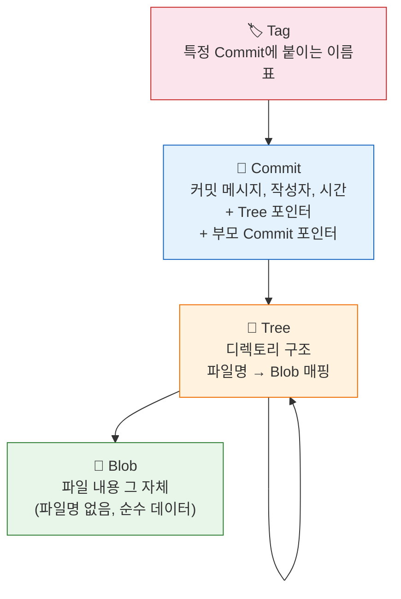
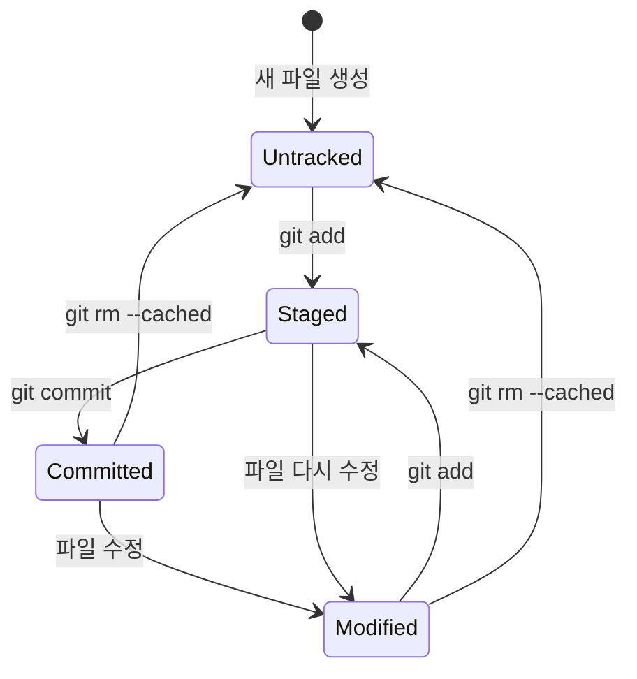
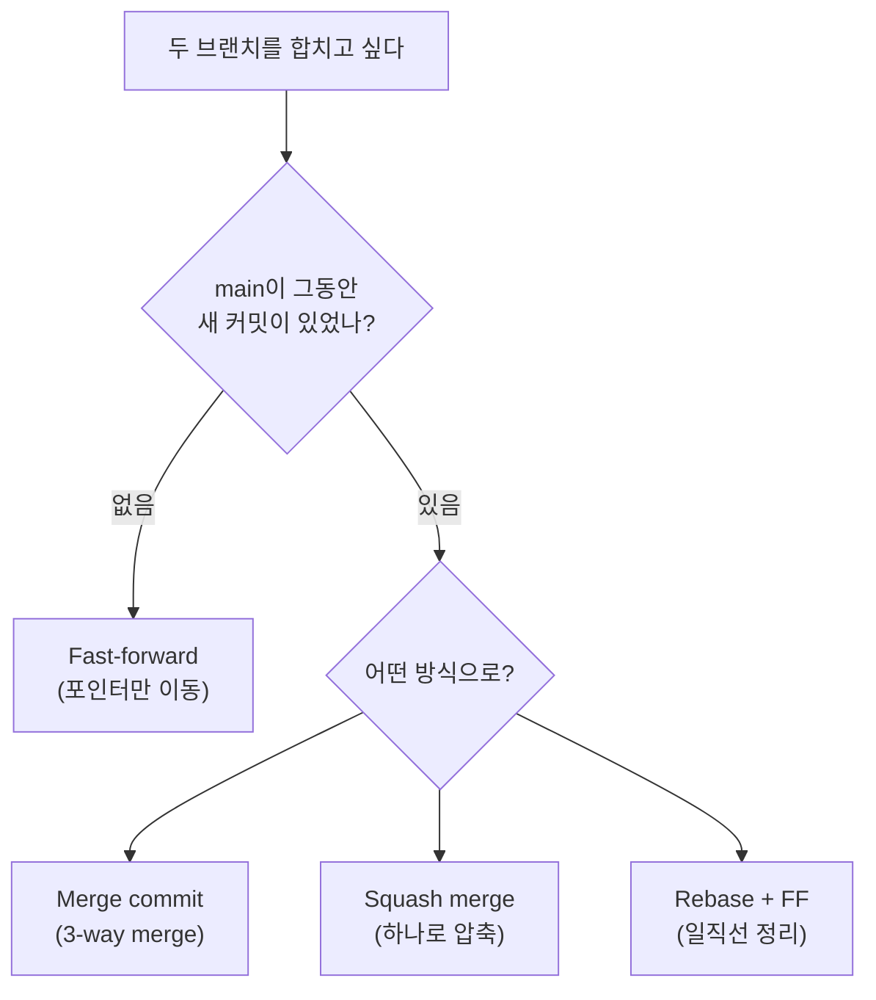
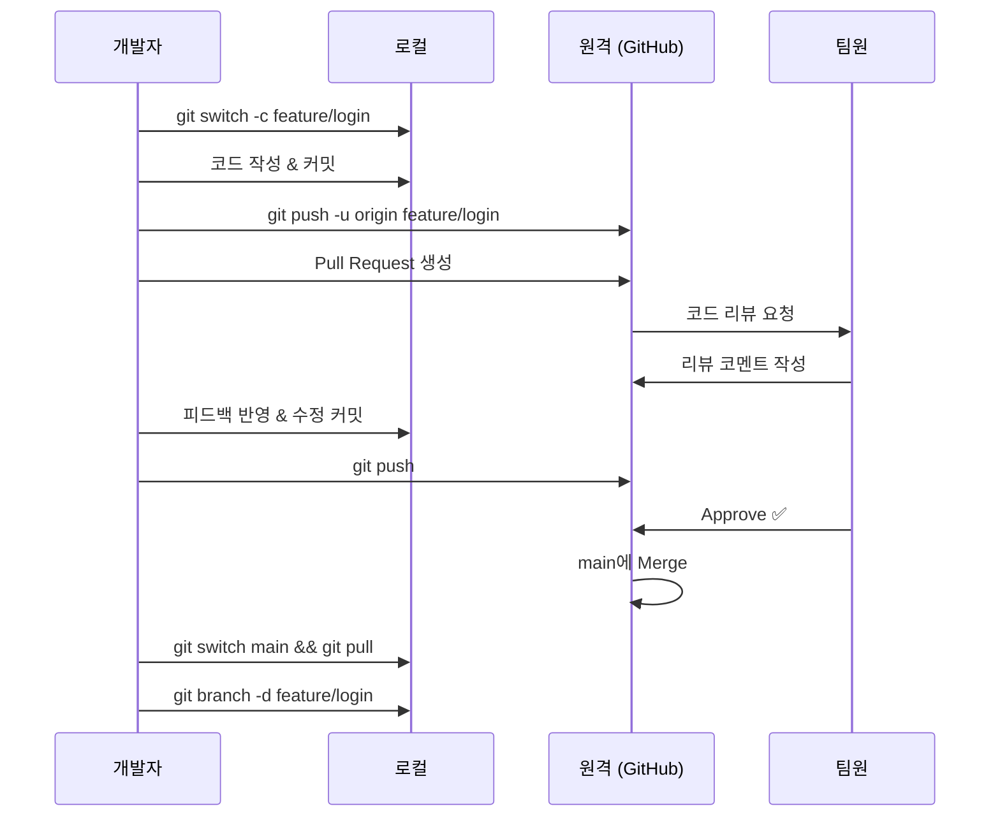

<div align="center">


<br>


<a href="https://git-scm.com">
  
</a>

<br>


이 가이드는 명령어 나열이 아니라, **왜 그렇게 동작하는지**를 알려줍니다.

<br>


[Part 1: 개념](#part-1--git의-세계관) · [Part 2: 실전](#part-2--매일-쓰는-git) · [Part 3: 브랜치](#part-3--브랜치-전략) · [Part 4: 협업](#part-4--팀과-함께-쓰는-git) · [Part 5: 고급](#part-5--프로처럼-쓰는-git) · [Part 6: 트러블슈팅](#part-6--트러블슈팅)

</div>

---

# 📚 목차

### 🧠 Part 1 — 개념
- [Ch 1. Git은 스냅샷이다](#ch-1-git은-스냅샷이다)
- [Ch 2. Git의 내부 구조](#ch-2-git의-내부-구조)
- [Ch 3. 세 개의 영역과 파일의 생명주기](#ch-3-세-개의-영역과-파일의-생명주기)

### ⌨️ Part 2 — 실전
- [Ch 4. 설치와 초기 설정](#ch-4-설치와-초기-설정)
- [Ch 5. 저장소 만들기](#ch-5-저장소-만들기)
- [Ch 6. 일상적인 워크플로우](#ch-6-일상적인-워크플로우)
- [Ch 7. 히스토리 읽기](#ch-7-히스토리-읽기)
- [Ch 8. 커밋 메시지 컨벤션](#ch-8-커밋-메시지-컨벤션)

### 🌿 Part 3 — 브랜치
- [Ch 9. 브랜치의 본질](#ch-9-브랜치의-본질)
- [Ch 10. Merge의 모든 것](#ch-10-merge의-모든-것)
- [Ch 11. Rebase — 히스토리 다시 쓰기](#ch-11-rebase--히스토리-다시-쓰기)
- [Ch 12. 충돌 해결 완전 정복](#ch-12-충돌-해결-완전-정복)

### 👥 Part 4 — 협업
- [Ch 13. 원격 저장소 이해하기](#ch-13-원격-저장소-이해하기)
- [Ch 14. Push, Pull, Fetch의 관계](#ch-14-push-pull-fetch의-관계)
- [Ch 15. Pull Request 워크플로우](#ch-15-pull-request-워크플로우)
- [Ch 16. 브랜치 전략: Git Flow vs Trunk-Based](#ch-16-브랜치-전략-git-flow-vs-trunk-based)

### 🚀 Part 5 — 프로처럼
- [Ch 17. 되돌리기 총정리](#ch-17-되돌리기-총정리)
- [Ch 18. Stash — 작업 임시 보관](#ch-18-stash--작업-임시-보관)
- [Ch 19. Interactive Rebase](#ch-19-interactive-rebase)
- [Ch 20. Cherry-pick, Bisect, Reflog](#ch-20-cherry-pick-bisect-reflog)
- [Ch 21. Git Hooks & 자동화](#ch-21-git-hooks--자동화)
- [Ch 22. Submodule과 Subtree](#ch-22-submodule과-subtree)
- [Ch 23. Worktree](#ch-23-worktree)

### 🔧 Part 6 — 트러블슈팅
- [Ch 24. 자주 겪는 실수와 해결법](#ch-24-자주-겪는-실수와-해결법)
- [Ch 25. .gitignore 완전 가이드](#ch-25-gitignore-완전-가이드)
- [Ch 26. 성능 최적화](#ch-26-성능-최적화)

### 📎 부록
- [Appendix A: 명령어 치트시트](#appendix-a-명령어-치트시트)
- [Appendix B: Alias 추천 설정](#appendix-b-alias-추천-설정)
- [Appendix C: 추천 학습 자료](#appendix-c-추천-학습-자료)

---

<div align="center">

### 📊 학습 로드맵

```
🧠 개념        ██████░░░░░░░░░░░░░░░░░░░░  Part 1
⌨️ 실전        ██████████████░░░░░░░░░░░░  Part 2
🌿 브랜치      ██████████████████░░░░░░░░  Part 3
👥 협업        ██████████████████████░░░░  Part 4
🚀 고급        ████████████████████████░░  Part 5
🔧 트러블슈팅  ██████████████████████████  Part 6
```

 **처음부터 순서대로 읽어도 좋고, 필요한 챕터만 골라 읽어도 좋습니다.**

</div>

---

<br>

<div align="center">


# Part 1 — Git의 세계관

**명령어를 외우기 전에, Git이 세상을 바라보는 방식을 이해합니다.**

</div>

대부분의 Git 가이드는 `git add`, `git commit`부터 시작합니다.
하지만 **개념을 먼저 잡지 않으면**, 명령어를 외워도 응용할 수 없습니다.

---

<div align="center">

</div>

## Ch 1. Git은 스냅샷이다

### 흔한 오해: "Git은 변경사항(diff)을 저장한다"

**아닙니다.** Git은 매 커밋마다 **프로젝트 전체의 스냅샷**을 저장합니다.

```
❌ 잘못된 이해 (diff 기반):

  커밋 1 → 커밋 2 → 커밋 3
   [원본]   [+3줄]   [-1줄]

  "변경사항을 순서대로 쌓아가는 것"
```

```
✅ 올바른 이해 (스냅샷 기반):

  커밋 1        커밋 2        커밋 3
  ┌────────┐   ┌────────┐   ┌────────┐
  │ 파일 A │   │ 파일 A'│   │ 파일 A'│ ← 변경 없으면 이전 참조
  │ 파일 B │   │ 파일 B │   │ 파일 B'│
  │ 파일 C │   │ 파일 C'│   │ 파일 C'│
  └────────┘   └────────┘   └────────┘

  "매 커밋은 그 시점의 전체 프로젝트 상태"
```

> [!NOTE]
> 변경되지 않은 파일은 새로 저장하지 않고 이전 스냅샷의 참조만 유지합니다.
> 그래서 용량 걱정 없이 커밋을 자주 해도 됩니다.

### 왜 이게 중요한가?

이 구조 덕분에 Git은 다음을 할 수 있습니다:

| 능력 | 설명 |
|:---|:---|
| **즉시 브랜치 전환** | 스냅샷 간 이동이므로 diff를 재적용할 필요 없음 |
| **빠른 diff 계산** | 두 스냅샷을 비교하면 끝 |
| **안전한 병합** | 각 브랜치가 완전한 상태를 보유 |

> [!TIP]
> Git이 오프라인에서도 작동하는 이유는 스냅샷 모델이 아니라, **분산형 구조** 덕분입니다.
> 로컬에 전체 저장소 복제본이 있기 때문에 네트워크 없이도 커밋, 브랜치, 로그 조회가 가능합니다.

---

<div align="center">


</div>

## Ch 2. Git의 내부 구조

> [!TIP]
> `.git/` 폴더 안에 Git의 모든 마법이 들어있습니다.

### .git 디렉토리 해부

```
.git/
├── HEAD            ← 현재 어떤 브랜치에 있는지
├── config          ← 이 저장소의 설정
├── index           ← Staging Area (바이너리)
├── objects/        ← 모든 데이터 (blob, tree, commit)
│   ├── pack/       ← 압축된 객체들
│   └── info/
├── refs/           ← 브랜치와 태그 포인터
│   ├── heads/      ← 로컬 브랜치
│   ├── remotes/    ← 원격 브랜치
│   └── tags/       ← 태그
└── hooks/          ← Git Hook 스크립트
```

### Git의 4가지 객체

Git 내부에는 딱 **4종류**의 객체만 존재합니다.



모든 객체는 **SHA-1 해시**(40자리 16진수)로 식별됩니다.

```bash
# 커밋 객체 내용 확인
git cat-file -p HEAD

# 출력 예시:
# tree 4b825dc642cb6eb9a060e54bf899d15363cf7c4e
# parent 8a7b3f2e1d...
# author 홍길동 <hong@mail.com> 1700000000 +0900
# committer 홍길동 <hong@mail.com> 1700000000 +0900
#
# ✨ feat: 로그인 기능 추가
```

> [!NOTE]
> 이 구조를 알면 `git reset`, `git rebase` 같은 명령어가 **실제로 무엇을 하는지** 이해할 수 있습니다.
> 브랜치는 그냥 특정 커밋을 가리키는 포인터일 뿐이고, HEAD는 현재 브랜치를 가리키는 포인터입니다.

---

<div align="center">

</div>

## Ch 3. 세 개의 영역과 파일의 생명주기

### 세 영역

```
┌───────────────────────────────────────────────────────────────┐
│                                                               │
│  Working Directory        Staging Area         Repository     │
│  (작업 디렉토리)            (인덱스)              (.git)        │
│                                                               │
│  ┌─────────────┐        ┌─────────────┐     ┌──────────────┐ │
│  │             │ ─add─→ │             │ ─c→ │              │ │
│  │  파일 수정   │        │  커밋 준비    │     │  영구 기록    │ │
│  │             │ ←────  │             │     │              │ │
│  └─────────────┘        └─────────────┘     └──────────────┘ │
│                                                               │
│  실제 파일이 있는 곳       "다음 커밋에 포함할       커밋된 스냅샷   │
│                           파일 목록"              히스토리       │
│                                                               │
└───────────────────────────────────────────────────────────────┘
```

> [!IMPORTANT]
> Staging Area가 존재하는 이유:
> **커밋 단위를 내가 직접 설계**할 수 있기 때문입니다.
> 10개 파일을 수정했어도, 관련 있는 3개만 골라서 하나의 커밋으로 만들 수 있습니다.
> SVN처럼 변경사항 전체가 한 번에 들어가는 것이 아니라,
> **내가 원하는 범위만 골라서 커밋**할 수 있는 것이 Git의 핵심 차이입니다.

### 파일의 생명주기



> [!NOTE]
> `git rm --cached`는 파일을 **유지하면서 추적만 중단**합니다.
> `git rm`은 파일 자체를 **삭제하고 삭제를 Stage**하는 명령이므로, Untracked가 아니라 파일이 사라집니다.

| 상태 | `git status`에서 보이는 모습 | 의미 |
|:---|:---|:---|
| **Untracked** | 빨간색, "Untracked files" | Git이 전혀 모르는 새 파일 |
| **Modified** | 빨간색, "Changes not staged" | 추적 중인 파일이 수정됨 |
| **Staged** | 녹색, "Changes to be committed" | 다음 커밋에 포함될 예정 |
| **Committed** | 표시 안 됨 | 안전하게 저장 완료 |

---

<br>

<div align="center">


# Part 2 — 매일 쓰는 Git

**여기서부터 손에 흙을 묻힙니다.**

</div>

---

<div align="center">

</div>

## Ch 4. 설치와 초기 설정

### 설치

<details>
<summary><b>Windows</b></summary>

[git-scm.com](https://git-scm.com)에서 설치 파일을 다운로드하여 실행합니다.
설치 옵션은 기본값 그대로 진행해도 무방합니다.
설치 후 Git Bash 또는 PowerShell에서 `git --version`으로 확인합니다.

</details>

<details>
<summary><b>macOS</b></summary>

```bash
# Homebrew (권장)
brew install git

# 또는 Xcode CLT
xcode-select --install
```

</details>

<details>
<summary><b>Linux (Ubuntu/Debian)</b></summary>

```bash
sudo apt update && sudo apt install git
```

</details>

### 필수 초기 설정

```bash
# ── 신원 등록 (모든 커밋에 기록됨) ──
git config --global user.name "홍길동"
git config --global user.email "hong@example.com"

# ── 기본 브랜치 이름 ──
git config --global init.defaultBranch main

# ── 줄바꿈 처리 (협업 시 중요) ──
# Windows
git config --global core.autocrlf true
# macOS / Linux
git config --global core.autocrlf input

# ── 기본 에디터 ──
git config --global core.editor "code --wait"   # VS Code
# git config --global core.editor "vim"          # Vim
# git config --global core.editor "nano"         # Nano
```

### 설정 확인

```bash
git config --list --show-origin
# 어떤 설정 파일에서 어떤 값이 적용되는지 한눈에 확인
```

> [!TIP]
> Git 설정은 3단계 우선순위가 있습니다.
> `--system` (시스템 전체) < `--global` (사용자) < `--local` (저장소)
> 같은 키가 여러 레벨에 있으면 **가장 좁은 범위가 우선**합니다.

---

<div align="center">

</div>

## Ch 5. 저장소 만들기

### 방법 1: 새로 만들기

```bash
mkdir my-project && cd my-project
git init
```

이 순간 `.git/` 디렉토리가 생성되며, 이 폴더가 Git 저장소가 됩니다.
아직 커밋은 없는 상태입니다.

### 방법 2: 기존 프로젝트 복제

```bash
# 기본
git clone https://github.com/user/repo.git

# 폴더 이름 지정
git clone https://github.com/user/repo.git my-folder

# 최신 커밋 1개만 (대규모 저장소에서 빠르게 받기)
git clone --depth 1 https://github.com/user/repo.git

# 특정 브랜치만
git clone -b develop --single-branch https://github.com/user/repo.git
```

> [!NOTE]
> `git clone`은 `git init` + `git remote add` + `git fetch` + `git checkout`을 한 번에 수행합니다.

---

<div align="center">

</div>

## Ch 6. 일상적인 워크플로우

매일 반복하는 핵심 사이클입니다.

```
 ┌──────────────────────────────────────────────────────────┐
 │  코드 작성 → git add → git commit → (반복) → git push   │
 └──────────────────────────────────────────────────────────┘
```

### 1단계: 상태 확인

```bash
git status

# 짧은 버전
git status -s
```

`git status -s`의 출력 형식:

```
 M README.md       ← 수정됨 (Unstaged)
M  app.js          ← 수정됨 (Staged)
MM server.js       ← Staged 후 다시 수정됨
?? new-file.txt    ← Untracked
A  added.txt       ← 새로 추가됨 (Staged)
D  deleted.txt     ← 삭제됨
R  old.txt -> new.txt ← 이름 변경됨
```

> [!TIP]
> 왼쪽 열은 Staging Area 상태, 오른쪽 열은 Working Directory 상태입니다.

### 2단계: Staging

```bash
# 특정 파일
git add README.md

# 현재 디렉토리 전체
git add .

# 패턴
git add "*.js"
git add src/

# 대화형 — 파일 내 특정 부분만 선택적으로 Stage
git add -p
```

**`git add -p`는 실무에서 매우 유용합니다.** 하나의 파일 안에서도 변경 단위(hunk)를 골라 Stage할 수 있습니다.

```
@@ -10,6 +10,8 @@ function login() {
+  validate(email);        ← 이 변경은 Stage 하고
+  logAttempt(email);      ← 이 변경은 나중에 커밋하고 싶을 때

Stage this hunk [y,n,q,a,d,s,e,?]?
```

| 키 | 의미 |
|:---:|:---|
| `y` | 이 hunk를 Stage |
| `n` | 건너뜀 |
| `s` | 더 작은 단위로 분할 |
| `e` | 직접 편집 |
| `q` | 종료 |

### 3단계: Commit

```bash
git commit -m "메시지"

# 에디터에서 긴 메시지 작성
git commit

# Tracked 파일의 수정사항을 add 없이 바로 커밋
git commit -am "메시지"
```

> [!WARNING]
> `git commit -am`은 **Untracked 파일(새 파일)**은 포함하지 않습니다.
> 새 파일이 있다면 반드시 `git add`를 먼저 해야 합니다.

### 4단계: 변경 내용 비교

```bash
# Working Directory vs Staging Area
git diff

# Staging Area vs 마지막 커밋
git diff --staged

# 커밋 간 비교
git diff HEAD~3 HEAD

# 파일 단위 비교
git diff -- src/app.js

# 변경된 파일 이름만 보기
git diff --name-only

# 변경 통계
git diff --stat
```

---

<div align="center">

</div>

## Ch 7. 히스토리 읽기

### git log 활용

```bash
# 기본
git log

# 한 줄 요약
git log --oneline

# 그래프 시각화
git log --oneline --graph --all

# 최근 N개
git log -5

# 특정 파일의 이력
git log -- src/app.js

# 파일 이름이 바뀌어도 추적
git log --follow -- src/app.js

# 특정 내용이 변경된 커밋 찾기
git log -S "함수명"

# 특정 함수의 변경 이력 (매우 강력)
git log -L :functionName:src/app.js

# 작성자 필터
git log --author="홍길동"

# 날짜 범위
git log --since="2024-01-01" --until="2024-06-30"

# 커밋 메시지 검색
git log --grep="로그인"

# 변경 내용과 함께
git log -p

# 변경 통계와 함께
git log --stat

# 예쁜 포맷
git log --pretty=format:"%h %an %ar %s"
```

### git log 포맷 변수

| 변수 | 의미 | 예시 |
|:---|:---|:---|
| `%H` | 전체 해시 | `a1b2c3d4e5f6...` |
| `%h` | 짧은 해시 | `a1b2c3d` |
| `%an` | 작성자 이름 | `홍길동` |
| `%ae` | 작성자 이메일 | `hong@mail.com` |
| `%ar` | 상대 시간 | `2 hours ago` |
| `%s` | 커밋 메시지 | `feat: 로그인` |

### git blame — 줄 단위 추적

```bash
# 누가 어떤 줄을 마지막으로 수정했는지
git blame src/app.js

# 특정 범위만
git blame -L 10,20 src/app.js
```

### git show — 커밋 상세 보기

```bash
# 특정 커밋의 변경 내용
git show abc1234

# 특정 커밋의 특정 파일
git show abc1234:src/app.js
```

---

<div align="center">

</div>

## Ch 8. 커밋 메시지 컨벤션

### Conventional Commits

업계에서 가장 널리 사용되는 형식입니다.

```
<type>(<scope>): <subject>
                                ← 빈 줄
<body>                          ← 선택
                                ← 빈 줄
<footer>                        ← 선택
```

### Type 목록

| Type | 의미 | 예시 |
|:---|:---|:---|
| `feat` | 새로운 기능 | `feat(auth): 소셜 로그인 추가` |
| `fix` | 버그 수정 | `fix(cart): 수량 음수 입력 방지` |
| `docs` | 문서 변경 | `docs: API 엔드포인트 문서 업데이트` |
| `style` | 포맷팅, 세미콜론 등 (동작 변화 없음) | `style: ESLint 경고 수정` |
| `refactor` | 리팩토링 (기능 변화 없음) | `refactor(user): 서비스 레이어 분리` |
| `perf` | 성능 개선 | `perf: 이미지 지연 로딩 적용` |
| `test` | 테스트 추가/수정 | `test(auth): 로그인 실패 케이스 추가` |
| `build` | 빌드 시스템, 외부 의존성 | `build: webpack 5로 마이그레이션` |
| `ci` | CI 설정 변경 | `ci: GitHub Actions 캐시 추가` |
| `chore` | 기타 잡일 | `chore: .gitignore 업데이트` |

### 좋은 커밋 메시지 원칙

```
✅ 좋은 예시:
  fix(payment): 결제 완료 후 재고 차감 누락 수정

  결제 완료 콜백에서 재고 차감 로직이 빠져 있어
  주문은 완료되지만 재고가 줄지 않는 문제가 있었음.

  Closes #247
```

```
❌ 나쁜 예시:
  수정
  fix
  버그 고침
  wip
  aaaa
```

**원칙 정리:**

1. **제목은 50자 이내**, 명령형으로 ("추가한다" X → "추가" O)
2. **제목과 본문 사이에 빈 줄** 하나
3. **본문은 "왜"에 집중** (코드를 보면 "무엇"은 알 수 있으니까)
4. **관련 이슈 번호** 연결 (`Closes #123`, `Refs #456`)

---

<br>

<div align="center">


# Part 3 — 브랜치 전략

**Git의 진짜 힘은 브랜치에서 나옵니다.**

</div>

---

<div align="center">

</div>

## Ch 9. 브랜치의 본질

### 브랜치는 포인터다

브랜치의 실체는 `.git/refs/heads/` 안에 있는 **40자리 텍스트 파일**입니다.
그 안에는 커밋 해시 하나만 적혀 있습니다.

```bash
cat .git/refs/heads/main
# → a1b2c3d4e5f6a7b8c9d0e1f2a3b4c5d6e7f8a9b0
```

그래서 브랜치 생성은 **순식간**에 이루어집니다. 파일 하나 만드는 것이니까요.
SVN처럼 디렉토리 전체를 복사하는 것이 아닙니다.

```
HEAD → main → commit C
               ↑
               │
           feature → commit C  (같은 커밋을 가리킴)

브랜치를 만든 직후에는 두 브랜치가 같은 커밋을 가리킵니다.
이후 각자 커밋하면 갈라집니다.
```

### 브랜치 기본 명령어

```bash
# ── 조회 ──
git branch                  # 로컬 브랜치
git branch -a               # 전체 (로컬 + 원격)
git branch -v               # 각 브랜치의 마지막 커밋
git branch --merged         # 현재 브랜치에 이미 병합된 브랜치
git branch --no-merged      # 아직 병합되지 않은 브랜치

# ── 생성 ──
git branch feature/login              # 생성만
git switch -c feature/login           # 생성 + 이동 (권장)
git checkout -b feature/login         # 생성 + 이동 (레거시)
git switch -c feature/login origin/develop  # 원격 브랜치 기반으로 생성

# ── 이동 ──
git switch main              # 권장
git checkout main            # 레거시

# ── 이름 변경 ──
git branch -m old-name new-name
git branch -m new-name       # 현재 브랜치 이름 변경

# ── 삭제 ──
git branch -d feature/login  # 병합된 브랜치만 삭제
git branch -D feature/login  # 강제 삭제
```

> [!TIP]
> `git switch`와 `git restore`는 Git 2.23에서 도입되었습니다.
> `git checkout`이 브랜치 이동과 파일 복원을 모두 담당해서 혼란스러웠기 때문에,
> **브랜치 이동은 `switch`**, **파일 복원은 `restore`**로 분리한 것입니다.

### 브랜치 네이밍 컨벤션

| 접두사 | 용도 | 예시 |
|:---|:---|:---|
| `feature/` | 새 기능 개발 | `feature/oauth-login` |
| `fix/` 또는 `bugfix/` | 버그 수정 | `fix/cart-total-calc` |
| `hotfix/` | 긴급 수정 (프로덕션) | `hotfix/payment-crash` |
| `release/` | 릴리즈 준비 | `release/2.1.0` |
| `chore/` | 잡일 | `chore/update-deps` |
| `refactor/` | 리팩토링 | `refactor/user-service` |

---

<div align="center">

</div>

## Ch 10. Merge의 모든 것

### Merge 유형 비교



#### 1. Fast-forward Merge

main에 새 커밋이 없을 때, 포인터만 앞으로 이동합니다.

```
Before:
  A ── B ── C ── D ← feature
       ↑
      main

After (git merge feature):
  A ── B ── C ── D ← feature, main
                 ↑
             main이 여기로 이동
```

```bash
git switch main
git merge feature/login
# Fast-forward 발생
```

#### 2. 3-way Merge (Merge Commit)

main에도 새 커밋이 있을 때, **병합 커밋**이 생깁니다.

```
Before:
               C ── D ← feature
              /
  A ── B ── E ── F
                 ↑
                main

After (git merge feature):
               C ── D
              /       \
  A ── B ── E ── F ── M
                      ↑
                main (merge commit)
```

```bash
git switch main
git merge feature/login
# Merge commit 생성
```

#### 3. Squash Merge

feature의 모든 커밋을 **하나로 압축**해서 반영합니다.

```
Before:
               C ── D ── E ← feature (3개 커밋)
              /
  A ── B
       ↑
      main

After (git merge --squash feature):
  A ── B ── S  (S에 C+D+E 내용이 합쳐짐)
             ↑
            main
```

```bash
git switch main
git merge --squash feature/login
git commit -m "feat(auth): 로그인 기능 추가"
```

> [!NOTE]
> Squash merge 후에는 feature 브랜치의 커밋 히스토리가 main에 남지 않습니다.
> PR 단위로 깔끔한 히스토리를 원할 때 유용합니다.

#### 4. No Fast-forward

Fast-forward가 가능한 상황에서도 강제로 merge commit을 만듭니다.
"이 기능은 별도 브랜치에서 개발했다"는 기록을 남기고 싶을 때 사용합니다.

```bash
git merge --no-ff feature/login
```

### 언제 어떤 Merge를 쓰나?

| 상황 | 추천 전략 | 이유 |
|:---|:---|:---|
| 간단한 1~2개 커밋 hotfix | Fast-forward | 히스토리 간결 |
| PR로 기능 개발 완료 | Squash merge | PR 단위로 깔끔한 히스토리 |
| 장기 브랜치 병합 (release 등) | `--no-ff` | 브랜치 경계를 기록 |
| 히스토리를 일직선으로 | Rebase + FF | 깔끔한 히스토리 |

---

<div align="center">

</div>

## Ch 11. Rebase — 히스토리 다시 쓰기

### Rebase란?

브랜치의 **시작 지점(base)**을 바꾸는 것입니다.

```
Before:
               C ── D ← feature
              /
  A ── B ── E ── F ← main

After (feature에서 git rebase main):

                          C' ── D' ← feature
                         /
  A ── B ── E ── F ← main

C'와 D'는 내용은 같지만 새로운 커밋(해시가 다름)입니다.
```

```bash
# feature 브랜치에서:
git switch feature/login
git rebase main

# 이후 main에서 Fast-forward merge:
git switch main
git merge feature/login
```

### Merge vs Rebase

| | Merge | Rebase |
|:---|:---|:---|
| **히스토리** | 분기 이력 보존 | 일직선 정리 |
| **커밋 해시** | 기존 유지 | 새로 생성됨 |
| **충돌 해결** | 한 번에 | 커밋마다 발생 가능 |
| **안전성** | 히스토리 변경 없음 | 히스토리 재작성 |
| **사용 시점** | 공유된 브랜치 | 로컬 브랜치 정리 |

> [!CAUTION]
> **Golden Rule: 이미 Push한 커밋은 Rebase하지 마세요.**
> 다른 사람이 그 커밋을 기반으로 작업 중일 수 있습니다.
> Rebase는 커밋 해시를 바꾸기 때문에, 협업 중인 브랜치에서 사용하면 히스토리가 꼬입니다.

> [!NOTE]
> Ch 1에서 설명한 것처럼, Git은 모든 히스토리를 로컬에 가지고 있습니다.
> Rebase는 이 로컬 히스토리를 **재작성**하는 연산입니다.
> 아직 Push하지 않은 커밋은 내 로컬에만 있으므로 자유롭게 Rebase할 수 있지만,
> Push된 커밋은 다른 사람의 로컬에도 복제되어 있기 때문에,
> 내가 해시를 바꿔버리면 상대방의 히스토리와 충돌이 발생합니다.

### Rebase 중 충돌 해결

```bash
git rebase main
# 충돌 발생!

# 1. 충돌 파일 수정
# 2. Stage
git add .
# 3. Rebase 계속 진행
git rebase --continue

# 또는 이 커밋 건너뛰기
git rebase --skip

# 또는 전체 취소 (원래 상태로 복귀)
git rebase --abort
```

---

<div align="center">


</div>

## Ch 12. 충돌 해결 완전 정복

### 충돌은 왜 발생하는가?

두 브랜치가 **같은 파일의 같은 부분**을 서로 다르게 수정했을 때 발생합니다.
Git은 어느 쪽이 맞는지 판단할 수 없으므로, 사람에게 결정을 맡깁니다.

### 충돌 파일의 구조

```
자동으로 병합된 부분 (충돌 없는 영역)
...

<<<<<<< HEAD
현재 브랜치 (내 코드)
=======
병합 대상 브랜치 (상대 코드)
>>>>>>> feature/login

자동으로 병합된 부분 (충돌 없는 영역)
```

### 해결 절차

```bash
# 1. 충돌 발생 확인
git status
# "both modified: src/auth.js" 같은 메시지

# 2. 충돌 파일 열기 → <<<, ===, >>> 표시를 찾아 수정

# 3. 원하는 내용만 남기고 표시 삭제

# 4. Stage & Commit
git add src/auth.js
git commit
# (merge인 경우 자동 메시지 생성됨)
```

### 실전 예시

**충돌 상태:**

```javascript
function getGreeting(name) {
<<<<<<< HEAD
  return `안녕하세요, ${name}님!`;
=======
  return `Hello, ${name}!`;
>>>>>>> feature/i18n
}
```

**해결 — 두 기능을 모두 살리기:**

```javascript
function getGreeting(name, locale = 'ko') {
  if (locale === 'ko') return `안녕하세요, ${name}님!`;
  return `Hello, ${name}!`;
}
```

### 충돌 해결 도구

```bash
# Git 내장 3-way merge 도구 실행
git mergetool

# VS Code를 merge 도구로 설정
git config --global merge.tool vscode
git config --global mergetool.vscode.cmd 'code --wait --merge $REMOTE $LOCAL $BASE $MERGED'
```

> [!TIP]
> VS Code에서는 충돌 발생 시 "Accept Current", "Accept Incoming", "Accept Both" 버튼이 표시됩니다.
> 하지만 복잡한 충돌에서는 버튼에 의존하지 말고, **코드를 읽고 직접 판단**하세요.

---

<br>

<div align="center">


# Part 4 — 팀과 함께 쓰는 Git

**혼자 쓰는 Git과 팀으로 쓰는 Git은 다른 도구입니다.**

</div>

---

<div align="center">


</div>

## Ch 13. 원격 저장소 이해하기

### 원격 저장소의 구조

```
                     ☁️ GitHub (origin)
                    ┌─────────────────┐
                    │  main           │
                    │  develop        │
                    │  feature/login  │
                    └─────────────────┘
                       ↑           ↓
                    git push    git fetch
                       ↑           ↓
   💻 내 컴퓨터       ┌─────────────────┐
                    │  main           │ ← 로컬 브랜치
                    │  origin/main    │ ← 원격 추적 브랜치
                    │  origin/develop │
                    └─────────────────┘
```

**원격 추적 브랜치(Remote-tracking branch):**
`origin/main`은 "마지막으로 fetch했을 때 원격의 main이 가리키던 커밋"을 의미합니다.
직접 수정할 수 없고, `git fetch` 또는 `git pull` 시에만 업데이트됩니다.

### 원격 저장소 관리

```bash
# ── 조회 ──
git remote -v

# ── 추가 ──
git remote add origin https://github.com/user/repo.git

# ── 여러 원격 저장소 (Fork 워크플로우) ──
git remote add upstream https://github.com/original/repo.git
# origin = 내 fork, upstream = 원본

# ── URL 변경 ──
git remote set-url origin https://github.com/user/new-repo.git

# ── 삭제 ──
git remote remove origin

# ── 상세 정보 ──
git remote show origin
```

---

<div align="center">


</div>

## Ch 14. Push, Pull, Fetch의 관계

### 3개 명령어 비교

```
                 ☁️ Remote
                 ┌──────┐
                 │      │
        push ──→ │      │ ←── fetch (데이터만 가져옴)
                 │      │
                 └──────┘
                    ↓
              pull = fetch + merge
                    ↓
                 💻 Local
```

### Push

```bash
# 첫 push (업스트림 설정)
git push -u origin main
# -u = --set-upstream : 이후부터 'git push'만 입력해도 됨

# 일반 push
git push

# 특정 브랜치
git push origin feature/login

# 원격 브랜치 삭제
git push origin --delete feature/login

# 태그 push
git push origin v1.0.0
git push origin --tags  # 모든 태그
```

### Fetch

```bash
# 모든 원격 브랜치 정보 가져오기 (로컬 파일 변경 없음)
git fetch origin

# 삭제된 원격 브랜치 정리
git fetch --prune

# 모든 원격 저장소에서
git fetch --all
```

### Pull

```bash
# 기본 (fetch + merge)
git pull origin main

# Rebase 방식 (merge commit 없이 깔끔하게)
git pull --rebase origin main

# 기본 pull 전략을 rebase로 설정
git config --global pull.rebase true
```

> [!TIP]
> `git pull --rebase`를 습관화하면 불필요한 merge commit 없이
> 히스토리가 깔끔해집니다. 많은 팀에서 권장하는 방식입니다.

### Push 거부 상황

```
 ! [rejected]        main -> main (fetch first)

이 에러가 발생하는 이유:
원격에 내가 모르는 새 커밋이 있어서,
그냥 push하면 그 커밋이 사라지기 때문입니다.
```

**해결 방법:**

```bash
# 방법 1: pull 후 push
git pull --rebase origin main
git push

# 방법 2: 강제 push (위험 — 팀에서 합의 없이 사용 금지)
git push --force-with-lease
# --force-with-lease는 --force보다 안전합니다.
# 마지막 fetch 이후 원격에 새 커밋이 있으면 거부합니다.
```

> [!CAUTION]
> `git push --force`는 원격의 커밋을 덮어씁니다.
> 다른 팀원의 작업이 사라질 수 있으니, 반드시 `--force-with-lease`를 사용하세요.

---

<div align="center">


</div>

## Ch 15. Pull Request 워크플로우

### PR 기반 개발 흐름



### PR 작성 팁

좋은 PR은 리뷰어의 시간을 절약합니다.

```markdown
## 개요
결제 완료 후 재고가 차감되지 않는 버그를 수정합니다.

## 변경 사항
- 결제 완료 콜백에 재고 차감 로직 추가
- 재고 부족 시 결제 진행 차단

## 테스트
- [x] 정상 결제 시 재고 차감 확인
- [x] 재고 0인 상품 결제 시도 → 에러 메시지 확인
- [x] 동시 주문 시 재고 정합성 확인

## 관련 이슈
Closes #247
```

### Fork & PR (오픈소스 기여)

```bash
# 1. 원본 저장소를 Fork (GitHub UI에서)
# 2. Fork한 저장소를 Clone
git clone https://github.com/내계정/repo.git

# 3. 원본을 upstream으로 등록
git remote add upstream https://github.com/원본/repo.git

# 4. 작업 브랜치 생성
git switch -c fix/typo-in-docs

# 5. 수정 & 커밋 & 푸시
git add .
git commit -m "docs: README 오타 수정"
git push origin fix/typo-in-docs

# 6. GitHub에서 PR 생성 (내 fork → 원본 저장소)

# 7. 원본에 변경이 있으면 동기화
git fetch upstream
git rebase upstream/main
git push --force-with-lease
```

---

<div align="center">

</div>

## Ch 16. 브랜치 전략: Git Flow vs Trunk-Based

### Git Flow

```
main ──────●───────────────────────●──────── (프로덕션)
            \                     /
develop ─────●──●──●──●──●──●──●──────────── (개발 통합)
              \       / \     /
feature ───────●──●──●   ●──●
                             \
release ──────────────────────●──────────────
                                \
hotfix ──────────────────────────●───────────
```

| 브랜치 | 용도 | 수명 |
|:---|:---|:---|
| `main` | 프로덕션 배포 코드 | 영구 |
| `develop` | 다음 릴리즈 개발 | 영구 |
| `feature/*` | 기능 개발 | develop에서 분기, 완료 시 병합 |
| `release/*` | 릴리즈 준비 (QA, 버전 업) | develop에서 분기, main+develop에 병합 |
| `hotfix/*` | 긴급 버그 수정 | main에서 분기, main+develop에 병합 |

**적합한 경우:** 릴리즈 주기가 긴 프로젝트, 명확한 버전 관리가 필요한 경우

### Trunk-Based Development

```
main ──●──●──●──●──●──●──●──●──●──●──●── (항상 배포 가능)
        \  /    \  /    \  /
feature  ●●      ●●      ●●   (수명이 매우 짧은 브랜치)
```

원칙:
- main 브랜치에 자주, 작은 단위로 병합
- Feature 브랜치는 1~2일 이내로 유지
- Feature Flag로 미완성 기능 숨김
- CI/CD 파이프라인 필수

**적합한 경우:** 지속적 배포(CD)를 하는 팀, 빠른 개발 사이클

### GitHub Flow (간소화 버전)

```
main ──●──────────────●──●──── (항상 배포 가능)
        \            /
feature  ●──●──●──●──  → PR → Merge
```

가장 단순한 워크플로우:
1. main에서 브랜치 생성
2. 작업 & 커밋
3. PR 생성
4. 리뷰 & 병합
5. 배포

**적합한 경우:** 소규모 팀, 웹 서비스

---

<br>

<div align="center">


# Part 5 — 프로처럼 쓰는 Git

**이제부터는 Git을 자유자재로 다루는 단계입니다.**

</div>

---

<div align="center">


</div>

## Ch 17. 되돌리기 총정리

Git의 되돌리기는 **"무엇을 되돌리고 싶은가"**에 따라 선택합니다.

### 상황별 명령어 매핑

```
┌──────────────────────────────────────────────────────────────────┐
│  나는 지금...                              │  이 명령을 써야 한다  │
├──────────────────────────────────────────────────────────────────┤
│                                                                  │
│  📝 파일 수정을 취소하고 싶다 (add 전)                             │
│  → git restore <파일>                                            │
│                                                                  │
│  📦 add를 취소하고 싶다 (커밋 전)                                  │
│  → git restore --staged <파일>                                   │
│                                                                  │
│  💬 커밋 메시지를 수정하고 싶다                                     │
│  → git commit --amend                                            │
│                                                                  │
│  📎 직전 커밋에 파일을 빠뜨렸다                                     │
│  → git add <파일> && git commit --amend --no-edit                │
│                                                                  │
│  ⏪ 커밋을 취소하되, 작업 내용은 남기고 싶다                         │
│  → git reset --soft HEAD~1                                       │
│                                                                  │
│  ⏪ 커밋 + add를 취소하되, 파일은 남기고 싶다                       │
│  → git reset HEAD~1       (--mixed가 기본값)                     │
│                                                                  │
│  💣 커밋 + 파일 변경까지 전부 되돌리고 싶다                          │
│  → git reset --hard HEAD~1                                       │
│                                                                  │
│  🔄 이미 Push한 커밋을 안전하게 취소하고 싶다                       │
│  → git revert <커밋해시>                                          │
│                                                                  │
│  📁 특정 커밋의 특정 파일만 가져오고 싶다                            │
│  → git restore --source=<커밋해시> -- <파일>                      │
│                                                                  │
└──────────────────────────────────────────────────────────────────┘
```

### reset 옵션 비교

```
                   Working Dir    Staging    Commits
                   (실제 파일)     (add 상태)  (기록)
 ─────────────────────────────────────────────────────
  --soft           유지 ✅         유지 ✅     취소 ❌
  --mixed (기본)   유지 ✅         취소 ❌     취소 ❌
  --hard           취소 ❌         취소 ❌     취소 ❌
```

### reset vs revert

| | `reset` | `revert` |
|:---|:---|:---|
| 방식 | 히스토리에서 커밋 삭제 | 취소하는 **새 커밋** 생성 |
| 히스토리 | 변경됨 (재작성) | 보존됨 (추가만) |
| Push된 커밋 | 사용 위험 | 안전하게 사용 가능 |
| 협업 시 | 비추천 | 추천 |

**원칙: 아직 Push하지 않았으면 `reset`, Push했으면 `revert`.**

---

<div align="center">

</div>

## Ch 18. Stash — 작업 임시 보관

### Stash가 필요한 순간

> 기능 개발 도중인데, 긴급 버그 수정 요청이 왔다.
> 커밋하기엔 애매하고, 그냥 브랜치를 바꾸면 수정 중인 파일이 섞인다.

```bash
# ── 기본 사용 ──
git stash                               # 임시 보관
git stash push -m "로그인 UI 작업 중"    # 메시지 포함 (권장)
git stash -u                            # Untracked 파일도 포함
git stash -a                            # .gitignore 대상까지 전부

# ── 목록 확인 ──
git stash list
# stash@{0}: On feature/login: 로그인 UI 작업 중
# stash@{1}: WIP on main: abc1234 이전 작업

# ── 복원 ──
git stash pop                  # 최근 stash 복원 + 목록에서 삭제
git stash apply                # 복원만 (목록에 유지)
git stash apply stash@{2}     # 특정 stash 복원

# ── 내용 미리보기 ──
git stash show                 # 변경 파일 목록
git stash show -p stash@{0}   # diff 보기

# ── 삭제 ──
git stash drop stash@{0}      # 특정 stash 삭제
git stash clear                # 전체 삭제

# ── stash를 새 브랜치로 ──
git stash branch new-branch stash@{0}
```

> [!TIP]
> `git stash push -m "설명"` 형태로 항상 메시지를 남기세요.
> stash가 쌓이면 어떤 작업인지 알 수 없게 됩니다.

---

<div align="center">

</div>

## Ch 19. Interactive Rebase

커밋 히스토리를 편집할 수 있는 강력한 도구입니다.

### 사용법

```bash
# 최근 4개 커밋을 편집
git rebase -i HEAD~4
```

에디터가 열리면 다음과 같은 화면이 나타납니다:

```
pick a1b2c3d feat: 로그인 UI
pick d4e5f6a fix: 오타 수정
pick b7c8d9e feat: 로그인 로직
pick f0a1b2c fix: 오타 또 수정
```

### 사용 가능한 명령어

| 명령 | 축약 | 설명 |
|:---|:---|:---|
| `pick` | `p` | 그대로 유지 |
| `reword` | `r` | 커밋 메시지만 수정 |
| `edit` | `e` | 커밋 내용 수정 (잠시 멈춤) |
| `squash` | `s` | 이전 커밋과 합치기 (메시지도 합침) |
| `fixup` | `f` | 이전 커밋과 합치기 (메시지는 버림) |
| `drop` | `d` | 커밋 삭제 |

### 실전 예시: 지저분한 커밋 정리

**Before:**
```
pick a1b2c3d feat: 로그인 UI
pick d4e5f6a fix: 오타 수정
pick b7c8d9e feat: 로그인 로직
pick f0a1b2c fix: 오타 또 수정
```

**편집 후:**
```
pick a1b2c3d feat: 로그인 UI
fixup d4e5f6a fix: 오타 수정
pick b7c8d9e feat: 로그인 로직
fixup f0a1b2c fix: 오타 또 수정
```

**After:** 오타 수정 커밋들이 각각 이전 커밋에 흡수되어 깔끔한 2개 커밋만 남습니다.

### 커밋 순서 변경

에디터에서 줄 순서를 바꾸면 커밋 순서가 바뀝니다.

```
# 순서 변경 전                     # 순서 변경 후
pick a1b2c3d 기능 A               pick b7c8d9e 기능 B
pick d4e5f6a 리팩토링              pick a1b2c3d 기능 A
pick b7c8d9e 기능 B               pick d4e5f6a 리팩토링
```

> [!CAUTION]
> Interactive rebase도 히스토리를 재작성합니다.
> Push한 커밋에는 사용하지 마세요.

### autosquash

커밋 메시지를 `fixup!` 또는 `squash!`로 시작하면, interactive rebase가 자동으로 매칭합니다.

```bash
# 원래 커밋
git commit -m "feat: 로그인 UI"

# 나중에 수정할 때
git commit -m "fixup! feat: 로그인 UI"

# autosquash 적용
git rebase -i --autosquash HEAD~5
# fixup 커밋이 자동으로 원래 커밋 아래에 fixup으로 배치됨!
```

```bash
# 더 편하게: --fixup 플래그
git commit --fixup=<커밋해시>
```

---

<div align="center">


</div>

## Ch 20. Cherry-pick, Bisect, Reflog

### Cherry-pick

특정 커밋 하나만 현재 브랜치로 가져옵니다.

```
feature: A ── B ── C ── D
                    ↓ cherry-pick
main:    X ── Y ── C'
```

```bash
git cherry-pick abc1234

# 커밋 생성 없이 변경사항만 적용 (Stage 상태)
git cherry-pick --no-commit abc1234

# 여러 커밋
git cherry-pick abc1234 def5678

# 범위 (abc 다음부터 def까지)
git cherry-pick abc1234..def9012
```

**사용 시점:**
- hotfix를 여러 브랜치에 적용해야 할 때
- 다른 브랜치의 특정 커밋만 필요할 때
- 실수로 다른 브랜치에 커밋한 것을 옮길 때

### Bisect — 이진 검색으로 버그 찾기

수백 개 커밋 중 버그를 도입한 커밋을 빠르게 찾습니다.

```
1000개 커밋 중 버그 커밋 찾기:
  순차 검색: 최대 1000번 확인
  Bisect:   최대 10번 확인 (log₂1000 ≈ 10)
```

```bash
# 시작
git bisect start

# 현재 상태(버그 있음)를 bad으로 표시
git bisect bad

# 정상이었던 커밋을 good으로 표시
git bisect good v1.0.0

# → Git이 중간 커밋으로 checkout
# → 테스트 후 good 또는 bad 입력
git bisect good
# 또는
git bisect bad

# 반복하면 범인 커밋 발견!

# 종료
git bisect reset
```

**자동화:**

```bash
# 테스트 스크립트가 실패하는 커밋을 자동으로 찾기
git bisect start HEAD v1.0.0
git bisect run npm test
```

### Reflog — Git의 블랙박스

HEAD의 **모든 이동 기록**이 저장됩니다.
`reset --hard`로 날린 커밋도 여기서 찾을 수 있습니다.

```bash
git reflog

# 출력 예시:
# a1b2c3d HEAD@{0}: reset: moving to HEAD~3
# e4f5a6b HEAD@{1}: commit: 중요한 작업!
# c7d8e9a HEAD@{2}: commit: 이전 작업
```

**삭제된 커밋 복구:**

```bash
# reflog에서 복구 지점 확인
git reflog

# 해당 시점으로 복구
git reset --hard HEAD@{1}

# 또는 새 브랜치로 복구 (더 안전)
git switch -c recovered HEAD@{1}
```

**삭제된 브랜치 복구:**

```bash
# 실수로 브랜치를 삭제했을 때
git branch -D feature/important  # 아차!

# reflog에서 해당 브랜치의 마지막 커밋 찾기
git reflog

# 복구
git switch -c feature/important HEAD@{N}
```

> [!WARNING]
> Reflog는 **로컬에만** 존재하며, 기본 90일 후 만료됩니다.
> (`gc.reflogExpire` 설정으로 변경 가능)

---

<div align="center">

</div>

## Ch 21. Git Hooks & 자동화

### Hook 종류

| Hook | 실행 시점 | 주요 용도 |
|:---|:---|:---|
| `pre-commit` | 커밋 직전 | 린트, 포맷팅 검사 |
| `prepare-commit-msg` | 커밋 메시지 편집기 열리기 전 | 메시지 템플릿 자동 삽입 |
| `commit-msg` | 커밋 메시지 작성 후 | 메시지 형식 검증 |
| `pre-push` | push 직전 | 테스트 실행 |
| `post-merge` | merge 후 | 의존성 자동 설치 |
| `pre-rebase` | rebase 직전 | 위험한 rebase 방지 |

### 예시: pre-commit으로 린트 검사

```bash
#!/bin/sh
# .git/hooks/pre-commit

echo "🔍 린트 검사 중..."

# Staged 파일만 검사
FILES=$(git diff --cached --name-only --diff-filter=ACMR -- '*.js' '*.ts')

if [ -n "$FILES" ]; then
    npx eslint $FILES
    if [ $? -ne 0 ]; then
        echo "❌ 린트 실패. 커밋이 취소되었습니다."
        exit 1
    fi
fi

echo "✅ 린트 통과!"
exit 0
```

```bash
# 실행 권한 부여
chmod +x .git/hooks/pre-commit
```

### Husky + lint-staged (실무 표준)

`.git/hooks/`는 Git에 의해 추적되지 않아 팀원과 공유가 어렵습니다.
Husky를 사용하면 이 문제를 해결할 수 있습니다.

```bash
# 설치
npm install -D husky lint-staged
npx husky init
```

`package.json`:
```json
{
  "lint-staged": {
    "*.{js,ts,jsx,tsx}": ["eslint --fix", "prettier --write"],
    "*.{json,md}": ["prettier --write"]
  }
}
```

`.husky/pre-commit`:
```bash
npx lint-staged
```

이 설정으로 **커밋할 때마다 변경된 파일만 자동으로 린트 + 포맷팅**됩니다.

---

<div align="center">

</div>

## Ch 22. Submodule과 Subtree

### Submodule

프로젝트 안에 다른 Git 저장소를 **독립적으로** 포함합니다.

```bash
# 추가
git submodule add https://github.com/user/lib.git libs/lib

# Clone 시 Submodule 포함
git clone --recurse-submodules https://github.com/user/project.git

# 이미 Clone한 경우
git submodule init && git submodule update

# 모든 Submodule 최신으로 업데이트
git submodule update --remote --merge

# 상태 확인
git submodule status
```

> [!WARNING]
> Submodule은 **특정 커밋**을 가리킵니다.
> 업데이트 후 반드시 메인 프로젝트에서 커밋해야 합니다.

### Submodule 삭제

Submodule 삭제는 단순히 폴더를 지우는 것이 아닙니다. 3곳에서 흔적을 제거해야 합니다.

```bash
# 1. Submodule 등록 해제 (config에서 제거)
git submodule deinit -f libs/shared-utils

# 2. .git/modules에서 Submodule 데이터 제거
rm -rf .git/modules/libs/shared-utils

# 3. Git 추적 목록 및 작업 디렉토리에서 제거
git rm -f libs/shared-utils

# 4. 커밋
git commit -m "chore: shared-utils submodule 제거"
```

> [!TIP]
> `deinit`은 `.git/config`에서 제거, `git rm`은 `.gitmodules`와 작업 디렉토리에서 제거합니다.
> 둘 다 해야 깔끔하게 정리됩니다.

### Subtree

Submodule과 달리, 외부 저장소의 내용을 **현재 저장소에 직접 병합**합니다.

```bash
# 추가
git subtree add --prefix=libs/lib https://github.com/user/lib.git main --squash

# 업데이트
git subtree pull --prefix=libs/lib https://github.com/user/lib.git main --squash

# 변경사항을 원본에 Push
git subtree push --prefix=libs/lib https://github.com/user/lib.git main
```

### Submodule vs Subtree

| | Submodule | Subtree |
|:---|:---|:---|
| 구조 | 별도 저장소 참조 | 코드가 직접 포함 |
| Clone | `--recurse-submodules` 필요 | 추가 작업 없음 |
| 학습 곡선 | 높음 | 낮음 |
| 독립성 | 높음 (별도 저장소) | 낮음 (합쳐짐) |
| 적합한 경우 | 라이브러리, 공유 모듈 | 벤더 코드, 간단한 공유 |

---

<div align="center">

</div>

## Ch 23. Worktree

하나의 저장소에서 **여러 브랜치를 동시에 체크아웃**할 수 있습니다.

```bash
# 새 worktree 생성
git worktree add ../project-hotfix hotfix/critical-bug

# 새 브랜치를 만들면서 worktree 생성
git worktree add -b feature/new ../project-feature

# 목록 보기
git worktree list

# 삭제
git worktree remove ../project-hotfix
```

```
디렉토리 구조:

projects/
├── my-project/            ← main 브랜치 (원래 저장소)
├── project-hotfix/        ← hotfix 브랜치 (worktree)
└── project-feature/       ← feature 브랜치 (worktree)
```

**유용한 상황:**
- 긴급 hotfix를 처리하면서 기존 작업은 그대로 유지하고 싶을 때
- 두 브랜치를 동시에 비교하며 작업할 때
- 빌드가 오래 걸리는 프로젝트에서 브랜치별로 동시 빌드

stash와 달리 **작업 중인 상태를 건드리지 않아도** 됩니다.

---

<br>

<div align="center">


# Part 6 — 트러블슈팅

**실수는 누구나 합니다. 복구할 줄 아는 게 실력입니다.**

</div>

---

<div align="center">


</div>

## Ch 24. 자주 겪는 실수와 해결법

### 🔥 "실수로 잘못된 브랜치에 커밋했다"

```bash
# 방법: 커밋을 올바른 브랜치로 옮기기

# 1. 현재 커밋 해시 기억
git log --oneline -1
# → abc1234

# 2. 올바른 브랜치로 이동
git switch correct-branch

# 3. Cherry-pick
git cherry-pick abc1234

# 4. 잘못된 브랜치에서 커밋 제거
git switch wrong-branch
git reset --hard HEAD~1
```

### 🔥 "git add .을 했는데 큰 파일이 포함됐다"

```bash
# Stage에서 제거 (파일 자체는 유지)
git restore --staged large-file.zip
```

### 🔥 "Push한 커밋에 비밀키가 포함됐다"

> [!CAUTION]
> 비밀키가 한 번이라도 Push되었다면, **키를 즉시 폐기하고 새로 발급**하세요.
> Git 히스토리에서 제거해도 누군가 이미 복제했을 수 있습니다.

```bash
# 히스토리에서 파일 완전 제거 (git-filter-repo 사용, 권장)
pip install git-filter-repo
git filter-repo --path .env --invert-paths

# 강제 push
git push --force-with-lease --all
```

### 🔥 "merge를 했는데 되돌리고 싶다"

```bash
# 아직 커밋(merge commit)이 안 됐으면
git merge --abort

# 이미 merge commit이 됐으면
git revert -m 1 <merge-commit-hash>
# -m 1: 첫 번째 부모(main)를 기준으로 revert
```

### 🔥 "detached HEAD 상태에 빠졌다"

HEAD가 브랜치가 아닌 특정 커밋을 직접 가리키는 상태입니다.

```bash
# 현재 상태에서 새 브랜치 만들기
git switch -c new-branch

# 또는 기존 브랜치로 돌아가기
git switch main
```

### 🔥 "tracked 파일을 .gitignore에 추가했는데 계속 추적된다"

```bash
# Git의 추적 목록(index)에서 제거 (파일 자체는 유지)
git rm --cached <파일>
git commit -m "chore: 파일 추적 중단"
```

---

<div align="center">

</div>

## Ch 25. .gitignore 완전 가이드

### 문법

```gitignore
# 주석

# 특정 파일
secret.key

# 특정 확장자
*.log
*.tmp

# 특정 디렉토리
node_modules/
dist/
build/

# 하위 디렉토리 어디서든
**/logs/

# 부정 패턴 (예외)
*.log
!important.log     # important.log는 추적

# 특정 디렉토리 내 특정 확장자
doc/**/*.pdf
```

### 범용 템플릿

```gitignore
# ── OS ──
.DS_Store
Thumbs.db
Desktop.ini

# ── Editor / IDE ──
.idea/
.vscode/
*.swp
*.swo
*~

# ── 환경 변수 ──
.env
.env.*
!.env.example

# ── 의존성 ──
node_modules/
vendor/
venv/
__pycache__/
*.pyc

# ── 빌드 결과물 ──
dist/
build/
out/
*.exe
*.dll
*.so
*.dylib

# ── 로그 ──
*.log
logs/

# ── 테스트 커버리지 ──
coverage/
.nyc_output/
```

> [!TIP]
> [gitignore.io](https://www.toptal.com/developers/gitignore)에서
> 프로젝트 유형을 선택하면 .gitignore를 자동 생성해줍니다.

### 글로벌 .gitignore

모든 저장소에 공통으로 적용할 규칙:

```bash
git config --global core.excludesFile ~/.gitignore_global
```

`~/.gitignore_global`:
```gitignore
.DS_Store
Thumbs.db
.idea/
.vscode/
*.swp
```

---

## Ch 26. 성능 최적화

> [!NOTE]
> 이 섹션은 **일반적인 프로젝트에서는 필요하지 않습니다.**
> 다음 상황에 해당할 때 참고하세요:
> - 저장소 크기가 **1GB 이상**이거나 파일이 수만 개 이상
> - `git status`나 `git diff`가 **체감될 정도로 느림** (1초 이상)
> - 모노레포(monorepo)를 운영 중이거나, 히스토리가 수만 커밋 이상
> - CI/CD에서 Clone 시간이 병목인 경우

### 대규모 저장소에서의 팁

```bash
# Sparse Checkout — 필요한 디렉토리만 가져오기
git clone --no-checkout https://github.com/user/huge-repo.git
cd huge-repo
git sparse-checkout init --cone
git sparse-checkout set src/mymodule docs
git checkout main

# Partial Clone — Blob 없이 Clone (필요 시 다운로드)
git clone --filter=blob:none https://github.com/user/repo.git

# Shallow Clone — 히스토리 제한
git clone --depth 10 https://github.com/user/repo.git

# 이후 히스토리가 더 필요하면
git fetch --unshallow

# 가비지 컬렉션
git gc --aggressive

# fsmonitor 활성화 (대규모 저장소 status 속도 개선)
git config core.fsmonitor true          # Git 내장 (2.37+)
git config core.untrackedCache true
```

### Commit Graph 활성화

```bash
# log, merge-base 등의 속도 향상
git config --global fetch.writeCommitGraph true
git commit-graph write --reachable
```

---

<br>

<div align="center">


# 부록

</div>

---

## Appendix A: 명령어 치트시트

### 일상

| 명령어 | 설명 |
|:---|:---|
| `git init` | 저장소 생성 |
| `git clone <url>` | 원격 저장소 복제 |
| `git status` | 현재 상태 확인 |
| `git add <파일>` | Staging |
| `git add .` | 전체 Staging |
| `git add -p` | 부분 Staging |
| `git commit -m "msg"` | 커밋 |
| `git commit --amend` | 마지막 커밋 수정 |
| `git diff` | 변경사항 비교 |
| `git diff --staged` | Stage된 변경사항 |
| `git log --oneline` | 커밋 로그 |
| `git log --oneline --graph --all` | 그래프 로그 |

### 브랜치

| 명령어 | 설명 |
|:---|:---|
| `git branch` | 브랜치 목록 |
| `git switch -c <이름>` | 브랜치 생성 + 이동 |
| `git switch <이름>` | 브랜치 이동 |
| `git merge <이름>` | 병합 |
| `git merge --squash <이름>` | 스쿼시 병합 |
| `git rebase <이름>` | 리베이스 |
| `git branch -d <이름>` | 브랜치 삭제 |

### 원격

| 명령어 | 설명 |
|:---|:---|
| `git remote -v` | 원격 저장소 확인 |
| `git push -u origin <이름>` | 첫 Push (업스트림 설정) |
| `git push` | Push |
| `git pull` | Pull (fetch + merge) |
| `git pull --rebase` | Pull (fetch + rebase) |
| `git fetch` | Fetch만 |
| `git push origin --delete <이름>` | 원격 브랜치 삭제 |

### 되돌리기

| 명령어 | 설명 |
|:---|:---|
| `git restore <파일>` | 파일 수정 취소 |
| `git restore --staged <파일>` | add 취소 |
| `git reset --soft HEAD~1` | 커밋 취소 (Stage 유지) |
| `git reset HEAD~1` | 커밋+add 취소 |
| `git reset --hard HEAD~1` | 전부 취소 |
| `git revert <해시>` | 안전한 되돌리기 |
| `git stash` | 임시 보관 |
| `git stash pop` | 임시 보관 복원 |

### 조사 & 디버깅

| 명령어 | 설명 |
|:---|:---|
| `git blame <파일>` | 줄 단위 작성자 확인 |
| `git bisect start` | 이진 검색 시작 |
| `git reflog` | HEAD 이동 기록 |
| `git log -S "검색어"` | 코드 변경 검색 |
| `git show <해시>` | 커밋 상세 보기 |

---

## Appendix B: Alias 추천 설정

```bash
git config --global alias.s "status -s"
git config --global alias.l "log --oneline -20"
git config --global alias.lg "log --oneline --graph --all --decorate"
git config --global alias.co "checkout"
git config --global alias.sw "switch"
git config --global alias.br "branch"
git config --global alias.ci "commit"
git config --global alias.ca "commit --amend --no-edit"
git config --global alias.unstage "restore --staged"
git config --global alias.last "log -1 HEAD --stat"
git config --global alias.df "diff --stat"
git config --global alias.who "shortlog -sn --no-merges"
git config --global alias.stl "stash list"
git config --global alias.stp "stash pop"
```

설정 후 사용 예시:

```bash
git s              # git status -s
git l              # 최근 20개 커밋
git lg             # 그래프 로그
git ca             # 마지막 커밋에 현재 Stage된 내용 추가
git unstage .      # 전체 unstage
git who            # 기여자별 커밋 수
```

---

## Appendix C: 추천 학습 자료

| 자료 | 유형 | 설명 |
|:---|:---|:---|
| [Pro Git Book](https://git-scm.com/book/ko/v2) | 📖 책 (무료) | Git 공식 문서. 한국어 번역 있음 |
| [Learn Git Branching](https://learngitbranching.js.org/?locale=ko) | 🎮 인터랙티브 | 브라우저에서 브랜치를 시각적으로 연습 |
| [Git Immersion](https://gitimmersion.com) | 🧪 튜토리얼 | 단계별 실습 |
| [Oh My Git!](https://ohmygit.org) | 🎮 게임 | Git을 게임으로 배우기 |
| [Conventional Commits](https://www.conventionalcommits.org/ko/v1.0.0/) | 📋 스펙 | 커밋 메시지 컨벤션 |
| [GitHub Skills](https://skills.github.com) | 🎓 공식 교육 | GitHub 공식 실습 코스 |
| [gitignore.io](https://www.toptal.com/developers/gitignore) | 🛠️ 도구 | .gitignore 자동 생성 |

---

<div align="center">

<br>


### 🎉 여기까지 읽으셨다면, 당신은 이미 상위 10%입니다.


```
이 가이드가 도움이 되었다면 ⭐ Star를 눌러주세요.
오류나 개선 사항은 Issue로 남겨주세요.
```

<br>


<br>


<br>


</div>
